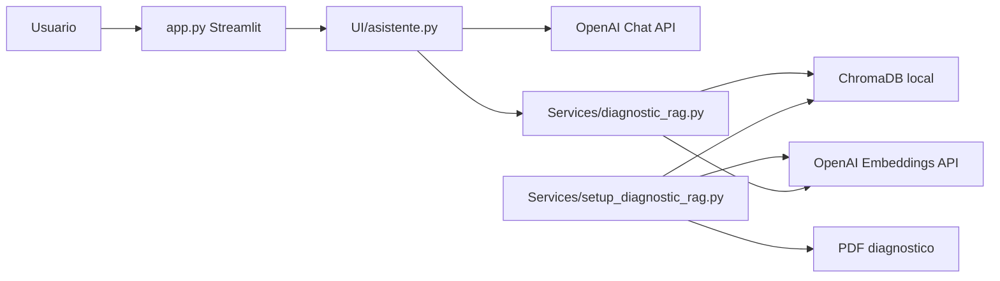
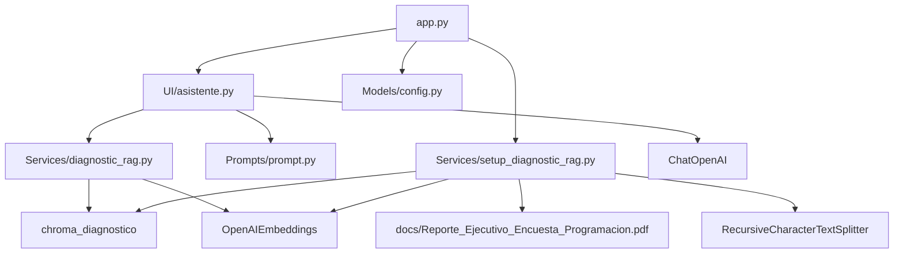

# Arquitectura del Proyecto

## 1. Resumen ejecutivo

El proyecto es una aplicacion web local construida con Streamlit que funciona como asistente educativo para aprender programacion. El sistema permite que el usuario haga preguntas en un chat, seleccione el tono del asistente y defina un modo de aprendizaje.

Ademas de responder preguntas generales de programacion, el asistente integra un flujo RAG sobre un documento PDF de diagnostico educativo. Cuando la consulta esta relacionada con la encuesta, el grupo, los estudiantes o el reporte, el sistema recupera fragmentos relevantes desde ChromaDB y los incorpora al prompt del modelo.

El estilo arquitectonico actual es un monolito modular con separacion ligera por carpetas:

- `UI/`: logica conversacional del asistente.
- `Services/`: procesamiento del PDF y recuperacion RAG.
- `Models/`: configuracion central.
- `Prompts/`: plantilla principal del LLM.
- `Documentacion/`: documentacion tecnica.
- `HU-docs/`: documentacion de historias de usuario.

## 2. Alcance del sistema

Responsabilidades implementadas:

- Renderizar una interfaz de chat con Streamlit.
- Permitir seleccion de tono del asistente.
- Permitir seleccion de modo de aprendizaje.
- Procesar un PDF diagnostico mediante LangChain.
- Dividir el documento en fragmentos recuperables.
- Crear una base vectorial persistente en ChromaDB.
- Recuperar contexto relevante mediante busqueda semantica.
- Invocar un modelo de OpenAI para generar respuestas pedagogicas.
- Mantener historial de chat en `st.session_state`.

Fuera del alcance actual:

- Autenticacion y autorizacion.
- API REST propia.
- Persistencia permanente del historial conversacional.
- LangGraph.
- Agents o Tools de LangChain.
- Evaluaciones automaticas.
- Observabilidad avanzada con LangSmith.
- Despliegue cloud documentado.
- Pruebas automatizadas.

## 3. Estilo arquitectonico

| Estilo | Aplica | Evidencia |
| --- | --- | --- |
| Monolito modular | Si | La aplicacion se ejecuta desde `app.py` y consume modulos internos. |
| Arquitectura por capas ligera | Parcial | `app.py` maneja la interfaz, `UI/asistente.py` coordina el caso de uso, `Services/` contiene RAG y procesamiento documental. |
| RAG | Si | PDF -> chunks -> embeddings -> ChromaDB -> contexto -> LLM. |
| LCEL | Si | La cadena usa `PromptTemplate | ChatOpenAI | StrOutputParser`. |
| LangGraph | No | No existen grafos, estados ni nodos de LangGraph. |
| Microservicios | No | No hay servicios separados ni comunicacion entre procesos. |

## 4. Componentes principales

| Componente | Archivo o carpeta | Responsabilidad |
| --- | --- | --- |
| Interfaz Streamlit | `app.py` | Renderiza la pagina, sidebar, chat, controles y acciones de configuracion. |
| Servicio del asistente | `UI/asistente.py` | Inicializa modelo, prompt, cadena LCEL y RAG. Procesa preguntas del usuario. |
| Recuperacion RAG | `Services/diagnostic_rag.py` | Clasifica consultas, consulta ChromaDB, formatea contexto y fuentes. |
| Procesador documental | `Services/setup_diagnostic_rag.py` | Carga el PDF, lo divide en chunks, genera embeddings y crea ChromaDB. |
| Configuracion | `Models/config.py` | Define rutas, modelos, temperatura, coleccion y cantidad de documentos recuperados. |
| Prompt | `Prompts/prompt.py` | Define reglas pedagogicas y comportamiento por tipo de consulta. |
| Documento fuente | `docs/` | Contiene el PDF de diagnostico educativo. |
| Base vectorial | `chroma_diagnostico/` | Persistencia local de embeddings y fragmentos. |

## 5. Diagramas





## 6. Flujo principal de consulta

1. El usuario escribe una pregunta en Streamlit.
2. `app.py` llama a `ask_assistant()`.
3. `UI/asistente.py` inicializa o reutiliza la cadena LCEL y el RAG.
4. `DiagnosticRAG` clasifica la consulta.
5. Si aplica, recupera documentos desde ChromaDB.
6. Se construye el prompt con pregunta, tono, modo, tipo de consulta y contexto.
7. `ChatOpenAI` genera la respuesta.
8. Streamlit muestra la respuesta y conserva el historial en sesion.

## 7. Arquitectura de IA y LangChain

| Elemento | Valor actual |
| --- | --- |
| Proveedor | OpenAI |
| Modelo de chat | `gpt-4o-mini` |
| Modelo de embeddings | `text-embedding-3-small` |
| Temperatura | `0.3` |
| Reintentos de chat | `max_retries=2` en `UI/asistente.py` |
| Recuperacion | `RETRIEVAL_K = 2` |
| Vector store | ChromaDB local |
| Framework UI | Streamlit |

La cadena principal se construye asi:

```python
prompt_template | llm | StrOutputParser()
```

## 8. Riesgos tecnicos identificados

| Prioridad | Riesgo | Evidencia | Recomendacion |
| --- | --- | --- | --- |
| Alta | Rutas de configuracion posiblemente incorrectas | `Models/config.py` usa `Path(__file__).resolve().parent`, por lo que `DOCS_DIR` apunta a `Models/docs`, no a `docs` en la raiz. | Cambiar `BASE_DIR` a `Path(__file__).resolve().parent.parent`. |
| Alta | Resumen incompleto del documento | `get_all_documents()` tiene `return documents` dentro del ciclo `for`. | Mover `documents.sort(...)` y `return documents` fuera del ciclo. |
| Alta | Modulo legado incompatible | `Services/ejemplo_Asistente_IA.py` invoca el prompt sin `tipo_consulta` ni `contexto_diagnostico`. | Actualizarlo o eliminarlo si ya no se usa. |
| Media | Imports wildcard | `app.py` usa `from UI.asistente import *` y `from Models.config import *`. | Usar imports explicitos. |
| Media | Validacion parcial de Chroma | `diagnostic_is_configured()` solo verifica si existe la carpeta. | Validar que la coleccion exista y tenga documentos. |
| Media | Falta de pruebas | No hay carpeta `tests/`. | Agregar pruebas unitarias para clasificacion, rutas, retrieval y errores. |


