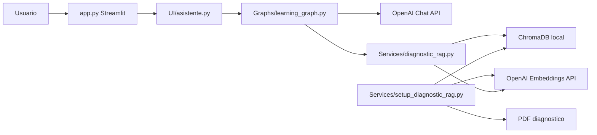
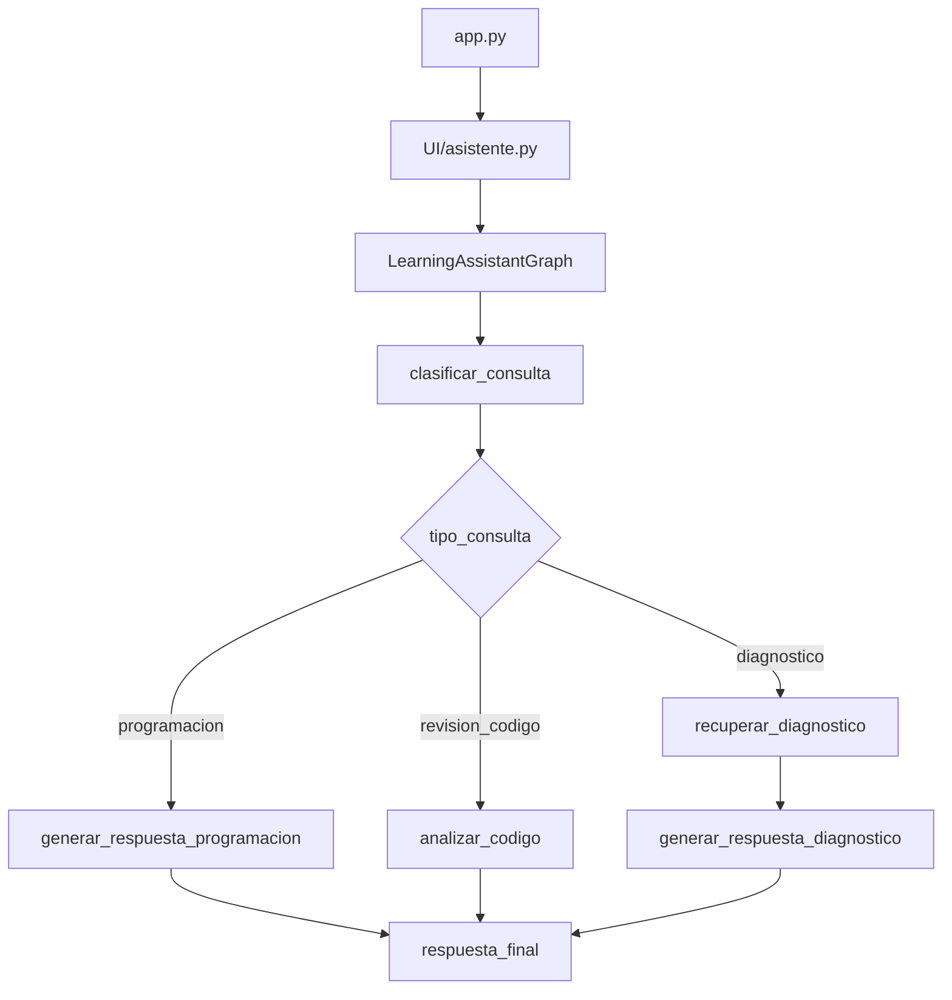

# Arquitectura del Proyecto

## 1. Descripcion general

El proyecto es una aplicacion web local construida con Streamlit que funciona como asistente educativo para aprender programacion. El sistema permite que el usuario haga preguntas en un chat, seleccione el tono del asistente y defina un modo de aprendizaje.

Ademas de responder preguntas generales de programacion, el asistente integra un flujo RAG sobre un documento PDF de diagnostico educativo. Cuando la consulta esta relacionada con la encuesta, el grupo, los estudiantes o el reporte, el sistema recupera fragmentos relevantes desde ChromaDB y los incorpora al prompt del modelo.

La version actual incorpora LangGraph como capa de orquestacion. Esto permite separar el proceso de respuesta en nodos: clasificacion de consulta, recuperacion diagnostica, generacion de respuesta, revision de codigo y respuesta final.

## 2. Alcance del sistema

Responsabilidades implementadas:

- Renderizar una interfaz de chat con Streamlit.
- Permitir seleccion de tono del asistente.
- Permitir seleccion de modo de aprendizaje.
- Procesar un PDF diagnostico mediante LangChain.
- Dividir el documento en fragmentos recuperables.
- Crear una base vectorial persistente en ChromaDB.
- Invocar un modelo de OpenAI para generar respuestas pedagogicas.
- Orquestar el flujo conversacional mediante LangGraph.
- Clasificar consultas como diagnostico, programacion o revision de codigo.
- Mantener historial de chat en `st.session_state`.

Fuera del alcance actual:

- Autenticacion y autorizacion.
- API REST propia.
- Persistencia permanente del historial conversacional.
- Checkpointing de LangGraph.
- Human-in-the-loop.
- Agents o Tools de LangChain.
- Evaluaciones automaticas.
- Observabilidad avanzada con LangSmith.
- Despliegue cloud documentado.
- Pruebas automatizadas.

## 3. Estilo arquitectonico

| Estilo | Aplica | Evidencia |
| --- | --- | --- |
| Monolito modular | Si | La aplicacion se ejecuta desde `app.py` y consume modulos internos. |
| Arquitectura por capas ligera | Si | `app.py` maneja UI, `UI/asistente.py` adapta Streamlit al grafo, `Graphs/` orquesta, `Services/` recupera y procesa datos. |
| RAG | Si | PDF -> chunks -> embeddings -> ChromaDB -> contexto -> LLM. |
| LCEL | Si | La generacion usa `PromptTemplate | ChatOpenAI | StrOutputParser`. |
| LangGraph | Si | `Graphs/learning_graph.py` define estado, nodos y rutas condicionales. |
| Microservicios | No | No hay servicios separados ni comunicacion entre procesos. |

## 4. Componentes principales

| Componente | Archivo o carpeta | Responsabilidad |
| --- | --- | --- |
| Interfaz Streamlit | `app.py` | Renderiza la pagina, sidebar, chat, controles y acciones de configuracion. |
| Adaptador del asistente | `UI/asistente.py` | Inicializa el grafo cacheado, procesa preguntas y devuelve respuesta/fuentes a Streamlit. |
| Grafo educativo | `Graphs/learning_graph.py` | Orquesta el flujo con LangGraph y separa nodos especializados. |
| Recuperacion RAG | `Services/diagnostic_rag.py` | Detecta consultas diagnosticas, consulta ChromaDB, formatea contexto y fuentes. |
| Procesador documental | `Services/setup_diagnostic_rag.py` | Carga el PDF, lo divide en chunks, genera embeddings y crea ChromaDB. |
| Configuracion | `Models/config.py` | Define rutas, modelos, temperatura, coleccion y cantidad de documentos recuperados. |
| Prompt | `Prompts/prompt.py` | Define reglas pedagogicas y comportamiento por tipo de consulta. |
| Documento fuente | `docs/` | Contiene el PDF de diagnostico educativo. |
| Base vectorial | `chroma_diagnostico/` | Persistencia local de embeddings y fragmentos. |

## 5. Diagramas





## 6. Flujo principal de consulta

1. El usuario escribe una pregunta en Streamlit.
2. `app.py` llama a `ask_assistant()`.
3. `UI/asistente.py` inicializa o reutiliza `LearningAssistantGraph`.
4. El grafo crea un estado con pregunta, tono, modo, fuentes y respuesta.
5. `clasificar_consulta` decide si la consulta es de diagnostico, programacion o revision de codigo.
6. Si es diagnostico, `recuperar_diagnostico` consulta ChromaDB.
7. El nodo de generacion correspondiente invoca la cadena LCEL.
8. `respuesta_final` prepara el resultado.
9. Streamlit muestra la respuesta y conserva el historial en sesion.

## 7. Arquitectura de IA, LangChain y LangGraph

| Elemento | Valor actual |
| --- | --- |
| Proveedor | OpenAI |
| Modelo de chat | `gpt-4o-mini` |
| Modelo de embeddings | `text-embedding-3-small` |
| Temperatura | `0.3` |
| Reintentos de chat | `max_retries=2` |
| Recuperacion | `RETRIEVAL_K = 2` |
| Vector store | ChromaDB local |
| Framework UI | Streamlit |
| Orquestacion | LangGraph con `StateGraph` |

Estado principal:

```python
class LearningAssistantState(TypedDict):
    question: str
    tono: str
    modo_aprendizaje: str
    tipo_consulta: str
    contexto_diagnostico: Optional[str]
    fuentes: list[dict]
    respuesta: Optional[str]
    requiere_revision_codigo: bool
    historial: Annotated[list[str], add]
```

La cadena de generacion se mantiene como LCEL:

```python
prompt_template | llm | StrOutputParser()
```

## 8. Riesgos tecnicos identificados

| Prioridad | Riesgo | Estado | Recomendacion |
| --- | --- | --- | --- |
| Alta | Resumen incompleto del documento | Corregido en `get_all_documents()`. | Agregar prueba unitaria para asegurar que devuelve todos los chunks. |
| Media | Imports wildcard | Pendiente en `app.py`. | Usar imports explicitos. |
| Media | Validacion parcial de Chroma | Pendiente. | Validar que la coleccion exista y tenga documentos. |
| Media | Falta de pruebas | Pendiente. | Agregar pruebas para nodos del grafo, clasificacion y RAG. |
| Media | Textos con mojibake | Pendiente. | Guardar archivos como UTF-8 y corregir literales. |
| Baja | Modulo legado incompatible | Pendiente. | Actualizar o retirar `Services/ejemplo_Asistente_IA.py`. |

