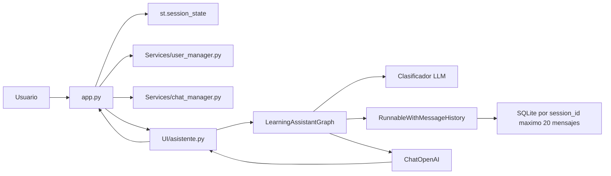
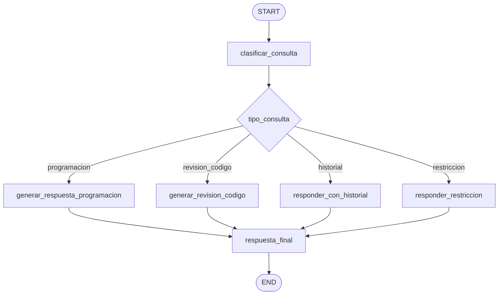

# Arquitectura del Proyecto

## 1. Descripcion general

El proyecto es una aplicacion web local construida con Streamlit que funciona como asistente educativo para aprender programacion. La version actual se centra en cinco capacidades: clasificar consultas con un LLM, enrutar el flujo con LangGraph, registrar usuarios locales, manejar multiples chats por usuario y mantener memoria persistente limitada a 20 mensajes por conversacion.

El asistente ya no usa recuperacion documental, PDF, embeddings ni base vectorial. Su dominio queda limitado a programacion, revision de codigo e historial conversacional relacionado con el aprendizaje.

## 2. Alcance del sistema

Responsabilidades implementadas:

- Renderizar una interfaz de chat con Streamlit.
- Mantener un tono fijo: `Normal, claro y amigable`.
- Mantener un modo pedagogico fijo: `Aprendizaje guiado`.
- Clasificar consultas mediante un LLM.
- Enrutar la conversacion mediante LangGraph.
- Generar respuestas pedagogicas con OpenAI.
- Mantener memoria conversacional persistente mediante SQLite y `RunnableWithMessageHistory`.
- Limitar cada historial de sesion a 20 mensajes.
- Crear usuarios locales con nombre, username y password.
- Iniciar sesion con credenciales locales.
- Mantener multiples chats separados por usuario.
- Restringir preguntas fuera del dominio de programacion.
- Reiniciar la memoria cuando el usuario limpia el chat.

Fuera del alcance actual:

- Persistencia permanente del historial.
- Base de datos para sesiones.
- RAG documental.
- Herramientas externas o agentes con tools.
- Checkpointing persistente de LangGraph.
- Autenticacion.
- Pruebas automatizadas completas.

## 3. Decisiones arquitectonicas

| Decision | Justificacion |
| --- | --- |
| Eliminar diagnostico/RAG | El nuevo alcance no requiere PDF, ChromaDB ni embeddings. |
| Clasificar con LLM | Evita depender de palabras clave fragiles o errores ortograficos exactos. |
| Usar una sola categoria por consulta | Mantiene el grafo simple para la etapa actual del aprendizaje. |
| Priorizar `revision_codigo` | Si el usuario pega codigo, el flujo mas util es revisar el codigo antes que explicar teoria general. |
| Usar memoria persistente local | Permite conservar contexto reciente aunque la aplicacion se reinicie. |
| Limitar memoria a 20 mensajes | Evita crecimiento indefinido del historial y controla el contexto enviado al modelo. |
| Construir `session_id` con usuario y chat | Evita mezclar historiales entre usuarios o conversaciones. |
| Gestion local de usuarios | Permite practicar separacion multiusuario sin autenticacion productiva. |

## 4. Componentes principales

| Componente | Archivo o carpeta | Responsabilidad |
| --- | --- | --- |
| Interfaz Streamlit | `app.py` | Renderiza pagina, chat, sidebar, temas sugeridos y estado visual. |
| Adaptador del asistente | `UI/asistente.py` | Inicializa el grafo cacheado y procesa consultas desde Streamlit. |
| Grafo educativo | `Graphs/learning_graph.py` | Clasifica, enruta y genera respuestas por nodos. |
| Memoria conversacional | `Services/conversation_memory.py` | Guarda y recupera historial por `session_id` con limite de 20 mensajes. |
| Gestion de usuarios | `Services/user_manager.py` | Crea usuarios locales y valida inicio de sesion. |
| Gestion de chats | `Services/chat_manager.py` | Crea, lista, selecciona y elimina chats por usuario. |
| Configuracion | `Models/config.py` | Define modelo, temperatura y ruta base. |
| Prompt | `Prompts/prompt.py` | Define reglas pedagogicas y comportamiento por tipo de consulta. |
| Dependencias | `Requirements/requirements.txt` | Lista dependencias necesarias del proyecto. |

## 5. Arquitectura de componentes



## 6. Flujo de LangGraph



## 7. Estado principal

```python
class LearningAssistantState(TypedDict):
    question: str
    session_id: str
    tono: str
    modo_aprendizaje: str
    tipo_consulta: str
    respuesta: Optional[str]
    historial: Annotated[list[str], add]
```

| Campo | Descripcion |
| --- | --- |
| `question` | Pregunta limpia del usuario. |
| `session_id` | Identificador de la sesion de memoria. |
| `tono` | Tono fijo enviado desde la interfaz. |
| `modo_aprendizaje` | Modo pedagogico fijo. |
| `tipo_consulta` | Categoria clasificada por el LLM. |
| `respuesta` | Respuesta generada para Streamlit. |
| `historial` | Trazas simples del flujo ejecutado. |

## 8. Clasificacion LLM

Categorias validas:

| Categoria | Descripcion |
| --- | --- |
| `programacion` | Preguntas conceptuales o practicas sobre programacion. |
| `revision_codigo` | Codigo, errores, traceback, debugging o analisis tecnico. |
| `historial` | Preguntas que dependen de recordar informacion previa o datos compartidos por el usuario. |
| `restriccion` | Cualquier tema fuera de programacion o historial conversacional. |

Para consultas con varias intenciones se aplica esta prioridad:

```text
revision_codigo > historial > programacion > restriccion
```

## 9. Memoria conversacional

La memoria se implementa con:

- `RunnableWithMessageHistory`
- `SQLiteLimitedChatMessageHistory`
- `session_id` generado desde `app.py`
- `conversation_memory.sqlite`

El prompt se construye como mensajes:

1. Mensaje de sistema con reglas pedagogicas.
2. `MessagesPlaceholder` para insertar historial real.
3. Mensaje humano con la nueva pregunta.

Esta decision evita convertir el historial en texto plano y permite que LangChain gestione mensajes de usuario/asistente correctamente.

Cada chat conserva como maximo 20 mensajes. Cuando se supera ese limite, se eliminan los mensajes mas antiguos y se conservan los mas recientes. Desde HU-07, el `session_id` se construye con el usuario y el chat activo usando el formato `user_{username}_chat_{chat_id}`.

## 10. Arquitectura visual

La interfaz mantiene una paleta visual aplicada desde `app.py` mediante CSS inyectado con `st.markdown`. Esta capa no modifica la logica de IA ni el flujo de LangGraph; su responsabilidad es mejorar la legibilidad, identidad visual y consistencia de la experiencia.

| Variable CSS | Color | Uso |
| --- | --- | --- |
| `--color-celeste` | `#95D1DC` | Bordes, mensajes y acentos suaves. |
| `--color-menta` | `#E7F0EA` | Fondo principal y sidebar. |
| `--color-azul` | `#1A77A3` | Titulos, botones y footer. |
| `--color-azul-oscuro` | `#155F82` | Hover de botones. |
| `--color-superficie` | `#F7FBFA` | Fondo claro de la aplicacion. |
| `--color-texto` | `#173642` | Texto principal. |

## 11. Riesgos tecnicos

| Riesgo | Impacto | Recomendacion |
| --- | --- | --- |
| Memoria limitada a 20 mensajes | Informacion antigua puede salir de la ventana de contexto. | Evaluar resumen o memoria vectorial en una HU futura. |
| Clasificacion LLM puede fallar | Una consulta podria caer en categoria incorrecta. | Agregar pruebas y fallback robusto. |
| Sin streaming | La respuesta aparece completa al final. | Integrar streaming cuando el flujo este estable. |
| Sin pruebas automatizadas | Cambios futuros pueden romper el grafo. | Crear tests para clasificacion, rutas y memoria. |

## 12. Evolucion por versiones

La evolucion por versiones documenta el camino del proyecto. Algunas historias de usuario son historicas y ya no forman parte del flujo activo, pero se conservan para entender las decisiones tecnicas tomadas durante el desarrollo.

| Version | Enfoque | Estado |
| --- | --- | --- |
| HU-001 | Chat educativo inicial con seleccion de tono. | Historico |
| HU-002 | Incorporacion de RAG diagnostico con PDF y ChromaDB. | Retirado del flujo actual |
| HU-003 | Integracion de LangGraph para orquestar consultas. | Base arquitectonica vigente |
| HU-004 | Aprendizaje guiado fijo, tono fijo y paleta visual. | Vigente |
| HU-005 | Clasificacion LLM, memoria conversacional y restriccion fuera de dominio. | Vigente |
| HU-006 | Memoria persistente por sesion con limite de 20 mensajes. | Vigente |
| HU-007 | Multiusuario y multiples chats con registro local. | Vigente |

La HU-02 queda documentada como antecedente tecnico, aunque el codigo actual ya no conserva el flujo de diagnostico/RAG. La HU-03 continua vigente porque LangGraph sigue siendo el mecanismo principal de orquestacion.
