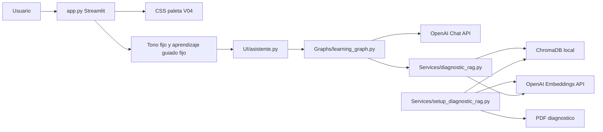
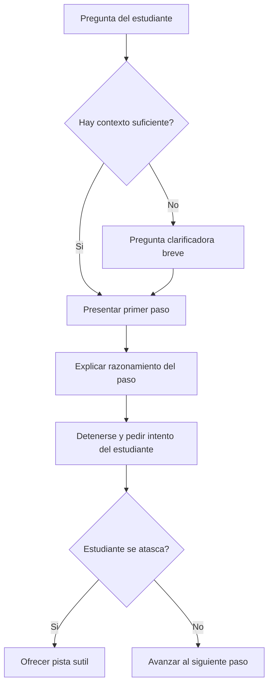

# Arquitectura del Proyecto

## 1. Descripcion general

<<<<<<< HEAD
El proyecto es una aplicacion web local construida con Streamlit que funciona como asistente educativo para aprender programacion. La version actual, V04, define una experiencia de aprendizaje guiado: el asistente no debe entregar respuestas completas de inmediato, sino orientar al estudiante paso a paso, explicar el razonamiento y detenerse para que el estudiante intente avanzar.

Ademas de responder preguntas generales de programacion, el asistente integra un flujo RAG sobre un documento PDF de diagnostico educativo. Cuando la consulta esta relacionada con la encuesta, el grupo, los estudiantes o el reporte, el sistema recupera fragmentos relevantes desde ChromaDB y los incorpora al prompt del modelo.

La aplicacion usa LangGraph como capa de orquestacion. Esto permite separar el proceso de respuesta en nodos: clasificacion de consulta, recuperacion diagnostica, generacion de respuesta, revision de codigo y respuesta final.
=======
El proyecto es una aplicacion web local construida con Streamlit que funciona como asistente educativo para aprender programacion. La version actual se centra en tres capacidades: clasificar consultas con un LLM, enrutar el flujo con LangGraph y mantener memoria temporal por sesion.

El asistente ya no usa recuperacion documental, PDF, embeddings ni base vectorial. Su dominio queda limitado a programacion, revision de codigo e historial conversacional relacionado con el aprendizaje.
>>>>>>> HU-005-fase-5-QA

## 2. Alcance del sistema

Responsabilidades implementadas:

- Renderizar una interfaz de chat con Streamlit.
- Mantener un tono fijo: `Normal, claro y amigable`.
- Mantener un modo pedagogico fijo: `Aprendizaje guiado`.
<<<<<<< HEAD
- Aplicar una paleta visual personalizada en la interfaz.
- Procesar un PDF diagnostico mediante LangChain.
- Dividir el documento en fragmentos recuperables.
- Crear una base vectorial persistente en ChromaDB.
- Invocar un modelo de OpenAI para generar respuestas pedagogicas.
- Orquestar el flujo conversacional mediante LangGraph.
- Clasificar consultas como diagnostico, programacion o revision de codigo.
- Mantener historial de chat en `st.session_state`.
- Documentar dependencias en `Requirements/requirements.txt`.
=======
- Clasificar consultas mediante un LLM.
- Enrutar la conversacion mediante LangGraph.
- Generar respuestas pedagogicas con OpenAI.
- Mantener memoria conversacional temporal mediante `RunnableWithMessageHistory`.
- Restringir preguntas fuera del dominio de programacion.
- Reiniciar la memoria cuando el usuario limpia el chat.
>>>>>>> HU-005-fase-5-QA

Fuera del alcance actual:

- Persistencia permanente del historial.
- Base de datos para sesiones.
- RAG documental.
- Herramientas externas o agentes con tools.
- Checkpointing persistente de LangGraph.
- Autenticacion.
- Pruebas automatizadas completas.

<<<<<<< HEAD
## 3. Decisiones arquitectonicas de la V04

| Decision | Justificacion |
| --- | --- |
| Quitar selector de tono | Reduce configuracion innecesaria y mantiene una voz consistente. |
| Usar tono fijo desde `app.py` | Evita modificar el grafo y mantiene compatibilidad con la firma existente. |
| Quitar selector de modo | Impide que el usuario seleccione un modo contrario al objetivo guiado. |
| Usar `Aprendizaje guiado` como constante | Convierte la intencion pedagogica en comportamiento por defecto del sistema. |
| Reforzar `PROGRAMMING_TEMPLATE` | La UI no basta para controlar el comportamiento del modelo; el prompt debe fijar reglas. |
| Aplicar paleta por CSS en `app.py` | Centraliza la personalizacion visual sin crear nuevos modulos ni dependencias. |
| Crear `Requirements/requirements.txt` | Hace reproducible la instalacion y evita depender del entorno local. |

## 4. Estilo arquitectonico

| Estilo | Aplica | Evidencia |
| --- | --- | --- |
| Monolito modular | Si | La aplicacion se ejecuta desde `app.py` y consume modulos internos. |
| Arquitectura por capas ligera | Si | `app.py` maneja UI, `UI/asistente.py` adapta Streamlit al grafo, `Graphs/` orquesta, `Services/` recupera y procesa datos. |
| RAG | Si | PDF -> chunks -> embeddings -> ChromaDB -> contexto -> LLM. |
| LCEL | Si | La generacion usa `PromptTemplate | ChatOpenAI | StrOutputParser`. |
| LangGraph | Si | `Graphs/learning_graph.py` define estado, nodos y rutas condicionales. |
| Theming local | Si | `app.py` inyecta CSS con la paleta visual de la V04. |
| Microservicios | No | No hay servicios separados ni comunicacion entre procesos. |
=======
## 3. Decisiones arquitectonicas

| Decision | Justificacion |
| --- | --- |
| Eliminar diagnostico/RAG | El nuevo alcance no requiere PDF, ChromaDB ni embeddings. |
| Clasificar con LLM | Evita depender de palabras clave fragiles o errores ortograficos exactos. |
| Usar una sola categoria por consulta | Mantiene el grafo simple para la etapa actual del aprendizaje. |
| Priorizar `revision_codigo` | Si el usuario pega codigo, el flujo mas util es revisar el codigo antes que explicar teoria general. |
| Usar memoria temporal en memoria RAM | Permite practicar `session_id` sin introducir base de datos todavia. |
| Reiniciar memoria con nuevo `session_id` | Limpiar el chat debe iniciar una conversacion nueva. |
>>>>>>> HU-005-fase-5-QA

## 5. Componentes principales

| Componente | Archivo o carpeta | Responsabilidad |
| --- | --- | --- |
<<<<<<< HEAD
| Interfaz Streamlit | `app.py` | Renderiza pagina, sidebar, chat, controles de diagnostico, constantes pedagogicas y tema visual. |
| Adaptador del asistente | `UI/asistente.py` | Inicializa el grafo cacheado, procesa preguntas y devuelve respuesta/fuentes a Streamlit. |
| Grafo educativo | `Graphs/learning_graph.py` | Orquesta el flujo con LangGraph y separa nodos especializados. |
| Recuperacion RAG | `Services/diagnostic_rag.py` | Detecta consultas diagnosticas, consulta ChromaDB, formatea contexto y fuentes. |
| Procesador documental | `Services/setup_diagnostic_rag.py` | Carga el PDF, lo divide en chunks, genera embeddings y crea ChromaDB. |
| Configuracion | `Models/config.py` | Define rutas, modelos, temperatura, coleccion y cantidad de documentos recuperados. |
| Prompt | `Prompts/prompt.py` | Define reglas pedagogicas, guia paso a paso y comportamiento por tipo de consulta. |
| Dependencias | `Requirements/requirements.txt` | Lista las dependencias directas necesarias para instalar el proyecto. |
| Documento fuente | `docs/` | Contiene el PDF de diagnostico educativo. |
| Base vectorial | `chroma_diagnostico/` | Persistencia local de embeddings y fragmentos. |

## 6. Diagramas

### 6.1 Arquitectura de componentes



### 6.2 Flujo de LangGraph

```mermaid
flowchart TD
    APP[app.py] --> CONST[Constantes pedagogicas]
    CONST --> ASIS[UI/asistente.py]
    ASIS --> GRAPH[LearningAssistantGraph]
    GRAPH --> CLAS[clasificar_consulta]
=======
| Interfaz Streamlit | `app.py` | Renderiza pagina, chat, sidebar, temas sugeridos y estado visual. |
| Adaptador del asistente | `UI/asistente.py` | Inicializa el grafo cacheado y procesa consultas desde Streamlit. |
| Grafo educativo | `Graphs/learning_graph.py` | Clasifica, enruta y genera respuestas por nodos. |
| Configuracion | `Models/config.py` | Define modelo, temperatura y ruta base. |
| Prompt | `Prompts/prompt.py` | Define reglas pedagogicas y comportamiento por tipo de consulta. |
| Dependencias | `Requirements/requirements.txt` | Lista dependencias necesarias del proyecto. |

## 5. Arquitectura de componentes

```mermaid
flowchart LR
    USER[Usuario] --> APP[app.py]
    APP --> STATE[st.session_state]
    APP --> UI[UI/asistente.py]
    UI --> GRAPH[LearningAssistantGraph]
    GRAPH --> CLASSIFIER[Clasificador LLM]
    GRAPH --> MEMORY[RunnableWithMessageHistory]
    MEMORY --> STORE[InMemoryChatMessageHistory por session_id]
    GRAPH --> OPENAI[ChatOpenAI]
    OPENAI --> UI
    UI --> APP
```

## 6. Flujo de LangGraph

```mermaid
flowchart TD
    START([START]) --> CLAS[clasificar_consulta]
>>>>>>> HU-005-fase-5-QA
    CLAS --> ROUTE{tipo_consulta}
    ROUTE -->|programacion| PROG[generar_respuesta_programacion]
    ROUTE -->|revision_codigo| CODE[generar_revision_codigo]
    ROUTE -->|historial| HIST[responder_con_historial]
    ROUTE -->|restriccion| REST[responder_restriccion]
    PROG --> FINAL[respuesta_final]
    CODE --> FINAL
    HIST --> FINAL
    REST --> FINAL
    FINAL --> END([END])
```

<<<<<<< HEAD
### 6.3 Flujo pedagogico guiado



## 7. Flujo principal de consulta

1. El usuario escribe una pregunta en Streamlit.
2. `app.py` usa `DEFAULT_ASSISTANT_TONE` y `DEFAULT_LEARNING_MODE`.
3. `app.py` llama a `ask_assistant()`.
4. `UI/asistente.py` inicializa o reutiliza `LearningAssistantGraph`.
5. El grafo crea un estado con pregunta, tono fijo, modo guiado, fuentes y respuesta.
6. `clasificar_consulta` decide si la consulta es de diagnostico, programacion o revision de codigo.
7. Si es diagnostico, `recuperar_diagnostico` consulta ChromaDB.
8. El nodo de generacion correspondiente invoca la cadena LCEL.
9. El prompt obliga al modelo a responder con aprendizaje guiado.
10. `respuesta_final` prepara el resultado.
11. Streamlit muestra la respuesta y conserva el historial en sesion.

## 8. Arquitectura de IA, LangChain y LangGraph

| Elemento | Valor actual |
| --- | --- |
| Proveedor | OpenAI |
| Modelo de chat | `gpt-4o-mini` |
| Modelo de embeddings | `text-embedding-3-small` |
| Temperatura | `0.3` |
| Reintentos de chat | `max_retries=2` |
| Recuperacion | `RETRIEVAL_K = 2` |
| Vector store | ChromaDB local |
| Framework UI | Streamlit |
| Orquestacion | LangGraph con `StateGraph` |
| Tono | Fijo desde `app.py` |
| Modo pedagogico | Fijo como `Aprendizaje guiado` |

Estado principal:
=======
## 7. Estado principal
>>>>>>> HU-005-fase-5-QA

```python
class LearningAssistantState(TypedDict):
    question: str
    session_id: str
    tono: str
    modo_aprendizaje: str
    tipo_consulta: str
    respuesta: Optional[str]
    historial: Annotated[list[str], add]
```

| Campo | Descripcion |
| --- | --- |
| `question` | Pregunta limpia del usuario. |
| `session_id` | Identificador de la sesion de memoria. |
| `tono` | Tono fijo enviado desde la interfaz. |
| `modo_aprendizaje` | Modo pedagogico fijo. |
| `tipo_consulta` | Categoria clasificada por el LLM. |
| `respuesta` | Respuesta generada para Streamlit. |
| `historial` | Trazas simples del flujo ejecutado. |

## 8. Clasificacion LLM

Categorias validas:

| Categoria | Descripcion |
| --- | --- |
| `programacion` | Preguntas conceptuales o practicas sobre programacion. |
| `revision_codigo` | Codigo, errores, traceback, debugging o analisis tecnico. |
| `historial` | Preguntas que dependen de recordar informacion previa o datos compartidos por el usuario. |
| `restriccion` | Cualquier tema fuera de programacion o historial conversacional. |

Para consultas con varias intenciones se aplica esta prioridad:

```text
revision_codigo > historial > programacion > restriccion
```

<<<<<<< HEAD
## 9. Arquitectura visual

La V04 incorpora una paleta visual aplicada desde `app.py` mediante CSS inyectado con `st.markdown`.

| Variable CSS | Color | Uso |
| --- | --- | --- |
| `--color-celeste` | `#95D1DC` | Bordes, mensajes y acentos suaves. |
| `--color-menta` | `#E7F0EA` | Fondo principal y sidebar. |
| `--color-azul` | `#1A77A3` | Titulos, botones y footer. |
| `--color-azul-oscuro` | `#155F82` | Hover de botones dentro de la misma gama cromatica. |
| `--color-superficie` | `#F7FBFA` | Fondo claro para app, header, contenedor inferior y entrada del chat. |
| `--color-texto` | `#173642` | Texto principal. |

Esta capa visual no modifica la logica de IA ni el flujo de LangGraph. Su responsabilidad es mejorar la legibilidad, identidad visual y consistencia de la experiencia. En el ajuste posterior de V04 se quitaron los acentos coral y amarillo de los elementos visibles para evitar contrastes innecesarios en la parte superior, en el contenedor inferior fijo y en la entrada del chat.

## 10. Riesgos tecnicos identificados

| Prioridad | Riesgo | Estado | Recomendacion |
| --- | --- | --- | --- |
| Media | Imports wildcard | Pendiente en `app.py`. | Usar imports explicitos. |
| Media | Validacion parcial de Chroma en sidebar | Pendiente. | Validar que la coleccion exista y tenga documentos. |
| Media | Falta de pruebas | Pendiente. | Agregar pruebas para nodos del grafo, clasificacion, RAG y reglas de prompt. |
| Media | CSS acoplado a `app.py` | Aceptado para V04. | Mover a archivo o helper si crece la interfaz. |
| Baja | Modulo legado incompatible | Pendiente. | Actualizar o retirar `Services/ejemplo_Asistente_IA.py`. |
| Baja | Fuentes RAG no visibles en el chat | Pendiente. | Renderizar `diagnostic_sources` debajo de respuestas diagnosticas. |

## 11. Evolucion por versiones

| Version | Enfoque |
| --- | --- |
| HU-001 | Chat educativo inicial con seleccion de tono. |
| HU-002 | Incorporacion de RAG diagnostico con ChromaDB. |
| HU-003 | Integracion de LangGraph para orquestar consultas. |
| HU-004 | Aprendizaje guiado fijo, tono fijo, paleta visual y dependencias. |
=======
## 9. Memoria conversacional

La memoria se implementa con:

- `RunnableWithMessageHistory`
- `InMemoryChatMessageHistory`
- `session_id` generado desde `app.py`

El prompt se construye como mensajes:

1. Mensaje de sistema con reglas pedagogicas.
2. `MessagesPlaceholder` para insertar historial real.
3. Mensaje humano con la nueva pregunta.

Esta decision evita convertir el historial en texto plano y permite que LangChain gestione mensajes de usuario/asistente correctamente.

## 10. Arquitectura visual

La interfaz mantiene una paleta visual aplicada desde `app.py` mediante CSS inyectado con `st.markdown`. Esta capa no modifica la logica de IA ni el flujo de LangGraph; su responsabilidad es mejorar la legibilidad, identidad visual y consistencia de la experiencia.

| Variable CSS | Color | Uso |
| --- | --- | --- |
| `--color-celeste` | `#95D1DC` | Bordes, mensajes y acentos suaves. |
| `--color-menta` | `#E7F0EA` | Fondo principal y sidebar. |
| `--color-azul` | `#1A77A3` | Titulos, botones y footer. |
| `--color-azul-oscuro` | `#155F82` | Hover de botones. |
| `--color-superficie` | `#F7FBFA` | Fondo claro de la aplicacion. |
| `--color-texto` | `#173642` | Texto principal. |

## 11. Riesgos tecnicos

| Riesgo | Impacto | Recomendacion |
| --- | --- | --- |
| Memoria solo en RAM | Se pierde al reiniciar la app. | Persistir en base de datos mas adelante. |
| Clasificacion LLM puede fallar | Una consulta podria caer en categoria incorrecta. | Agregar pruebas y fallback robusto. |
| Sin streaming | La respuesta aparece completa al final. | Integrar streaming cuando el flujo este estable. |
| Sin pruebas automatizadas | Cambios futuros pueden romper el grafo. | Crear tests para clasificacion, rutas y memoria. |

## 12. Evolucion por versiones

La evolucion por versiones documenta el camino del proyecto. Algunas historias de usuario son historicas y ya no forman parte del flujo activo, pero se conservan para entender las decisiones tecnicas tomadas durante el desarrollo.

| Version | Enfoque | Estado |
| --- | --- | --- |
| HU-001 | Chat educativo inicial con seleccion de tono. | Historico |
| HU-002 | Incorporacion de RAG diagnostico con PDF y ChromaDB. | Retirado del flujo actual |
| HU-003 | Integracion de LangGraph para orquestar consultas. | Base arquitectonica vigente |
| HU-004 | Aprendizaje guiado fijo, tono fijo y paleta visual. | Vigente |
| HU-005 | Clasificacion LLM, memoria conversacional y restriccion fuera de dominio. | Vigente |

La HU-02 queda documentada como antecedente tecnico, aunque el codigo actual ya no conserva el flujo de diagnostico/RAG. La HU-03 continua vigente porque LangGraph sigue siendo el mecanismo principal de orquestacion.
>>>>>>> HU-005-fase-5-QA
