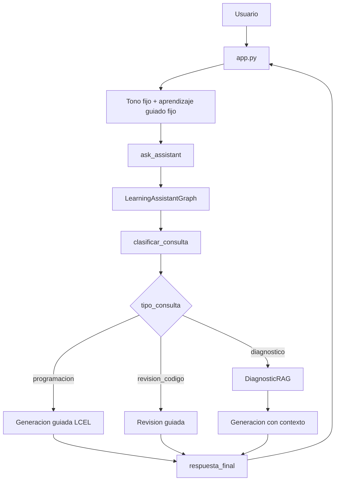

# Documentacion del Codigo

## 1. Descripcion general

<<<<<<< HEAD
El proyecto implementa un asistente educativo de programacion con interfaz en Streamlit, recuperacion RAG con ChromaDB y orquestacion mediante LangGraph.

En la version actual, V04, el objetivo pedagogico principal es el aprendizaje guiado. El asistente debe orientar al estudiante paso a paso, explicar el razonamiento, detenerse para que el estudiante trabaje cada parte y evitar entregar la respuesta final o el codigo completo de inmediato.
=======
El proyecto implementa un asistente educativo de programacion con interfaz en Streamlit, orquestacion mediante LangGraph, clasificacion de consultas con un LLM y memoria conversacional temporal por sesion.
>>>>>>> HU-005-fase-5-QA

El objetivo pedagogico principal es el aprendizaje guiado. El asistente orienta al estudiante paso a paso, explica el razonamiento, ofrece pistas progresivas y evita entregar respuestas finales o codigo completo de inmediato.

Tecnologias principales:

| Tecnologia | Uso |
| --- | --- |
| Python | Lenguaje principal del proyecto. |
| Streamlit | Interfaz web, chat, tema visual y estado de sesion. |
| LangGraph | Orquestacion del flujo mediante nodos y estado compartido. |
| LangChain / LCEL | Composicion de prompts, modelo y parser. |
| langchain-openai | Integracion con `ChatOpenAI`. |
| RunnableWithMessageHistory | Memoria conversacional por `session_id`. |

## 2. Estructura actual

```text
IA-Lanchaing/
|-- app.py
|-- README.md
|-- Documentacion/
|   |-- ARQUITECTURA_PROYECTO.md
|   `-- DOCUMENTACION_CODIGO.md
|-- Graphs/
|   |-- __init__.py
|   `-- learning_graph.py
|-- HU-docs/
|   |-- HU-001 - Asistente educativo de programacion con seleccion de tono.md
<<<<<<< HEAD
|   |-- HU_Asistente_Educativo_RAG.md
|   |-- HU_Integracion_LangGraph_Asistente_Educativo.md
|   `-- HU_04.md
=======
|   |-- HU_04.md
|   `-- HU_05.md
>>>>>>> HU-005-fase-5-QA
|-- Models/
|   `-- config.py
|-- Prompts/
|   `-- prompt.py
|-- Requirements/
|   `-- requirements.txt
|-- Services/
|   `-- ejemplo_Asistente_IA.py
`-- UI/
    `-- asistente.py
```

## 3. Punto de entrada

```bash
streamlit run app.py
```

Flujo general:

1. `app.py` configura la pagina.
<<<<<<< HEAD
2. `app.py` inyecta el CSS de la paleta visual V04.
3. Inicializa `st.session_state.messages`.
4. Define `DEFAULT_ASSISTANT_TONE` como `Normal, claro y amigable`.
5. Define `DEFAULT_LEARNING_MODE` como `Aprendizaje guiado`.
6. Renderiza sidebar, chat y temas sugeridos.
7. Permite reconstruir el diagnostico con `DiagnosticDocumentProcessor.setup()`.
8. Recibe preguntas con `st.chat_input`.
9. Llama a `ask_assistant()` desde `UI/asistente.py`.
10. `ask_assistant()` invoca `LearningAssistantGraph`.
11. El grafo clasifica y enruta la consulta.
12. Se genera una respuesta bajo reglas de aprendizaje guiado.
13. Se devuelven fuentes si aplica.
14. Streamlit guarda respuesta y ejecuta `st.rerun()`.
=======
2. Inicializa `st.session_state.messages`.
3. Inicializa `st.session_state.session_id`.
4. Renderiza sidebar, chat y temas sugeridos.
5. Recibe preguntas con `st.chat_input`.
6. Llama a `ask_assistant()` desde `UI/asistente.py`.
7. `ask_assistant()` invoca `LearningAssistantGraph`.
8. El grafo clasifica la consulta con un LLM.
9. LangGraph enruta hacia el nodo correspondiente.
10. La respuesta se genera con memoria conversacional.
11. Streamlit guarda la respuesta en el historial visual.
>>>>>>> HU-005-fase-5-QA

## 4. `app.py`

Responsabilidad: manejar la interfaz de usuario, aplicar el tema visual y enviar consultas al asistente.

<<<<<<< HEAD
Responsabilidad: manejar la interfaz de usuario, aplicar el tema visual y fijar la estrategia pedagogica que se envia al asistente.

Elementos relevantes:

| Elemento | Descripcion |
| --- | --- |
| CSS con `st.markdown` | Aplica la paleta V04 a fondo, sidebar, botones, alertas, chat, input y footer. |
| `DEFAULT_ASSISTANT_TONE` | Define el tono fijo `Normal, claro y amigable`. |
| `DEFAULT_LEARNING_MODE` | Define el modo fijo `Aprendizaje guiado`. |
| `st.session_state.messages` | Mantiene el historial visual del chat durante la sesion. |
=======
Elementos relevantes:
>>>>>>> HU-005-fase-5-QA

| Elemento | Descripcion |
| --- | --- |
| `st.set_page_config()` | Configura titulo, icono y layout. |
| CSS con `st.markdown()` | Aplica el estilo visual de la aplicacion. |
| `st.session_state.messages` | Guarda el historial visible del chat. |
| `st.session_state.session_id` | Identifica la memoria conversacional de la sesion. |
| `DEFAULT_ASSISTANT_TONE` | Tono fijo enviado al grafo. |
| `DEFAULT_LEARNING_MODE` | Modo pedagogico fijo enviado al grafo. |

<<<<<<< HEAD
Decisiones V04:

- Ya no existe selector de tono.
- Ya no existe selector de modo de aprendizaje.
- El sidebar muestra el modo guiado como informacion, no como control editable.
- La aplicacion sigue enviando `tono` y `modo_aprendizaje` para no modificar la interfaz interna del grafo.

### `UI/asistente.py`
=======
Cuando el usuario limpia el chat, tambien se genera un nuevo `session_id`. Esto evita que la memoria interna conserve informacion de una conversacion que visualmente ya fue borrada.

## 5. `UI/asistente.py`
>>>>>>> HU-005-fase-5-QA

Responsabilidad: adaptar la interfaz Streamlit al grafo de LangGraph.

| Funcion | Retorno | Descripcion |
| --- | --- | --- |
| `initialize_system()` | `LearningAssistantGraph` | Crea y cachea el grafo del asistente. |
| `ask_assistant(question, tono, modo_aprendizaje, session_id)` | `(response, [])` | Limpia la pregunta, invoca el grafo y devuelve la respuesta. |
| `get_assistant_info()` | `dict` | Devuelve metadatos publicos del asistente. |

Manejo de errores:

- Pregunta vacia: devuelve una respuesta amable solicitando una pregunta.
- Error general: captura la excepcion, registra el error y devuelve un mensaje tecnico controlado.

## 6. `Graphs/learning_graph.py`

Responsabilidad: orquestar el flujo del asistente educativo con LangGraph.

Elementos principales:

| Elemento | Tipo | Descripcion |
| --- | --- | --- |
| `VALID_CATEGORIES` | `set[str]` | Categorias permitidas por el clasificador. |
| `LearningAssistantState` | `TypedDict` | Estado compartido entre nodos. |
| `LearningAssistantGraph` | Clase | Construye modelo, cadenas, memoria y grafo compilado. |
| `create_learning_assistant_graph()` | Funcion | Factory usada por `UI/asistente.py`. |

### Estado

| Campo | Descripcion |
| --- | --- |
<<<<<<< HEAD
| `question` | Pregunta limpia del usuario. |
| `tono` | Tono recibido desde `app.py`; en V04 es fijo. |
| `modo_aprendizaje` | Modo recibido desde `app.py`; en V04 es fijo como aprendizaje guiado. |
| `tipo_consulta` | `diagnostico`, `programacion` o `revision_codigo`. |
| `contexto_diagnostico` | Contexto recuperado desde ChromaDB. |
| `fuentes` | Lista de fuentes recuperadas. |
| `respuesta` | Respuesta generada por el modelo. |
| `requiere_revision_codigo` | Bandera para consultas de revision de codigo. |
| `historial` | Trazas simples del flujo ejecutado. |
=======
| `question` | Pregunta del usuario. |
| `session_id` | Identificador de memoria conversacional. |
| `tono` | Tono de respuesta. |
| `modo_aprendizaje` | Estrategia pedagogica. |
| `tipo_consulta` | Categoria detectada. |
| `respuesta` | Respuesta final del modelo. |
| `historial` | Trazas internas del flujo. |
>>>>>>> HU-005-fase-5-QA

### Nodos

| Nodo | Descripcion |
| --- | --- |
<<<<<<< HEAD
| `clasificar_consulta` | Usa heuristicas para detectar diagnostico, programacion o revision de codigo. |
| `recuperar_diagnostico` | Ejecuta `DiagnosticRAG.get_context()` cuando la consulta requiere RAG. |
| `generar_respuesta_programacion` | Invoca la cadena sin contexto diagnostico. |
| `generar_respuesta_diagnostico` | Invoca la cadena con contexto recuperado desde ChromaDB. |
| `analizar_codigo` | Procesa revision de codigo bajo reglas de aprendizaje guiado. |
| `respuesta_final` | Cierra el flujo y deja la respuesta lista para la UI. |
=======
| `clasificar_consulta` | Usa un LLM para clasificar la pregunta. |
| `generar_respuesta_programacion` | Genera una respuesta guiada de programacion. |
| `generar_revision_codigo` | Guia la revision de codigo o errores. |
| `responder_con_historial` | Usa la memoria conversacional para responder. |
| `responder_restriccion` | Rechaza preguntas fuera de dominio de forma amable. |
| `respuesta_final` | Cierra el flujo. |
>>>>>>> HU-005-fase-5-QA

### Clasificador

El clasificador responde exclusivamente con una de estas categorias:

```text
programacion
revision_codigo
historial
restriccion
```

Si la respuesta del clasificador no coincide con una categoria valida, `_normalize_category()` usa `restriccion` como fallback.

### Memoria

<<<<<<< HEAD
| Metodo | Descripcion |
| --- | --- |
| `__init__(chroma_path)` | Valida existencia de Chroma e inicializa embeddings y vectorstore. |
| `count_documents()` | Cuenta fragmentos almacenados. |
| `get_all_documents()` | Recupera todos los documentos para resumenes. |
| `build_search_query(question)` | Construye una consulta enriquecida y define el tipo. |
| `retrieve(question)` | Recupera documentos segun tipo de consulta. |
| `format_context(documents)` | Convierte documentos recuperados en texto para el prompt. |
| `build_sources(documents)` | Deduplica fuentes por archivo y pagina. |
| `get_context(question)` | API principal usada por el nodo `recuperar_diagnostico`. |
=======
La memoria se guarda en:
>>>>>>> HU-005-fase-5-QA

```python
self.memory_store: dict[str, InMemoryChatMessageHistory] = {}
```

Cada `session_id` tiene su propio historial. La cadena principal usa:

```python
RunnableWithMessageHistory(
    chain,
    self.get_session_history,
    input_messages_key="question",
    history_messages_key="history",
)
```

## 7. `Prompts/prompt.py`

Responsabilidad: definir `PROGRAMMING_TEMPLATE`.

El prompt contiene:

- Rol del asistente como docente y mentor de programacion.
- Tono.
- Modo de aprendizaje.
- Tipo de consulta.
- Reglas generales de aprendizaje guiado.
- Reglas para `programacion`.
- Reglas para `revision_codigo`.
- Reglas para `historial`.
- Reglas para `restriccion`.

El historial no se inserta como texto dentro del template. Se inyecta como mensajes reales usando `MessagesPlaceholder` desde `Graphs/learning_graph.py`.

## 8. `Models/config.py`

Responsabilidad: centralizar configuracion basica.

| Constante | Valor |
| --- | --- |
| `BASE_DIR` | Raiz del proyecto. |
| `MODEL_NAME` | `gpt-4o-mini` |
| `TEMPERATURE` | `0.3` |

## 9. `Requirements/requirements.txt`

Dependencias principales:

| Paquete | Uso |
| --- | --- |
<<<<<<< HEAD
| `tono` | Estilo de comunicacion. En V04 llega fijo desde `app.py`. |
| `modo_aprendizaje` | Estrategia pedagogica. En V04 llega fija como `Aprendizaje guiado`. |
| `tipo_consulta` | Puede ser `diagnostico`, `programacion` o `revision_codigo`. |
| `contexto_diagnostico` | Fragmentos recuperados desde ChromaDB. |
| `question` | Pregunta del usuario. |

Reglas pedagogicas V04:

- Ayudar de manera guiada.
- Desglosar el problema paso a paso.
- Explicar el razonamiento detras de cada paso.
- Detenerse despues del primer paso.
- Pedir al estudiante que intente resolver esa parte.
- Usar preguntas clarificadoras cuando falte contexto.
- No revelar la conclusion ni el codigo completo de inmediato.
- Dar pistas sutiles si el estudiante se atasca.
- Guiar al estudiante hasta que pueda completar el ultimo paso.

### `Requirements/requirements.txt`

Responsabilidad: declarar dependencias directas del proyecto.

Incluye:

- `streamlit`
- `langchain`
- `langchain-community`
- `langchain-core`
- `langchain-openai`
- `langchain-text-splitters`
- `langgraph`
- `chromadb`
- `openai`
- `tiktoken`
- `pypdf`

### `Services/ejemplo_Asistente_IA.py`

Responsabilidad: ejemplo o version previa del asistente.

Observaciones:

- No esta importado por `app.py`.
- Define funciones con errores tipograficos: `ask_assistent()` y `get_assitent_info()`.
- Invoca `PROGRAMMING_TEMPLATE` sin enviar `tipo_consulta` ni `contexto_diagnostico`.
- Si se ejecuta con el prompt actual, puede fallar por variables faltantes.

## 5. Flujo de datos



## 6. Comandos utiles

Instalar dependencias:

```bash
pip install -r Requirements/requirements.txt
```

Procesar o reconstruir el diagnostico:

```bash
python -m Services.setup_diagnostic_rag
```
=======
| `streamlit` | Interfaz web. |
| `langchain` | Base de cadenas y abstracciones. |
| `langchain-core` | Prompts, parsers y memoria. |
| `langchain-openai` | Integracion con OpenAI. |
| `langgraph` | Orquestacion del flujo. |
| `openai` | Cliente OpenAI. |
| `tiktoken` | Tokenizacion. |

## 10. Comandos utiles
>>>>>>> HU-005-fase-5-QA

Ejecutar la aplicacion:

```bash
streamlit run app.py
```

Validar sintaxis de archivos principales:

```bash
python -m py_compile app.py Graphs/learning_graph.py UI/asistente.py Models/config.py Prompts/prompt.py
```

Buscar referencias eliminadas:

```bash
<<<<<<< HEAD
python -m py_compile app.py Graphs/learning_graph.py UI/asistente.py Services/diagnostic_rag.py Prompts/prompt.py
=======
rg "diagnost|RAG|Chroma|PDF|embedding|pypdf" app.py Graphs UI Models Prompts Requirements
>>>>>>> HU-005-fase-5-QA
```

## 11. Estado actual del codigo

<<<<<<< HEAD
- `normalize_text()` elimina tildes correctamente.
- `is_diagnostic_question()` clasifica preguntas del diagnostico.
- `is_summary_question()` detecta resumenes.
- `get_all_documents()` devuelve todos los chunks.
- `clasificar_consulta` enruta diagnostico, programacion y revision de codigo.
- `ask_assistant()` responde adecuadamente ante pregunta vacia.
- `ask_assistant()` maneja base vectorial inexistente.
- El prompt no entrega soluciones completas en la primera respuesta.
- `app.py` envia siempre `DEFAULT_ASSISTANT_TONE`.
- `app.py` envia siempre `DEFAULT_LEARNING_MODE`.
=======
Implementado:
>>>>>>> HU-005-fase-5-QA

- Grafo con cuatro rutas principales.
- Clasificacion con LLM.
- Memoria temporal por sesion.
- Restriccion fuera de dominio.
- Eliminacion de dependencias de RAG.

<<<<<<< HEAD
| Prioridad | Hallazgo | Recomendacion |
| --- | --- | --- |
| Alta | No hay pruebas del grafo. | Agregar tests para nodos y rutas condicionales. |
| Media | `diagnostic_is_configured()` solo revisa carpeta. | Validar conteo real de documentos en ChromaDB. |
| Media | Las fuentes RAG se guardan pero no se muestran. | Renderizar `diagnostic_sources` debajo de respuestas diagnosticas. |
| Media | CSS visual esta dentro de `app.py`. | Mantener asi por ahora; mover a helper si crece la UI. |
| Baja | Imports wildcard en `app.py`. | Reemplazar por imports explicitos. |
| Baja | Codigo legado en `Services/ejemplo_Asistente_IA.py`. | Actualizarlo o retirarlo. |
=======
Pendiente recomendado:

- Pruebas automatizadas del grafo.
- Streaming de respuestas.
- Persistencia real de memoria cuando se avance a bases de datos.
>>>>>>> HU-005-fase-5-QA
