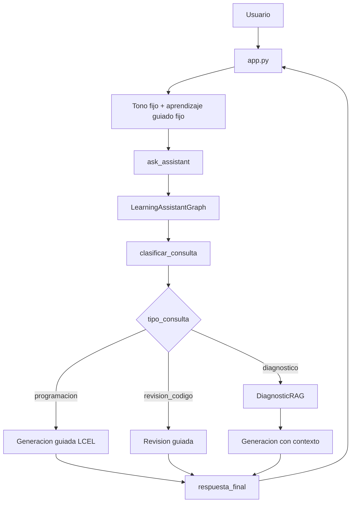

# Documentacion del Codigo

## 1. Descripcion general

El proyecto implementa un asistente educativo de programacion con interfaz en Streamlit, recuperacion RAG con ChromaDB y orquestacion mediante LangGraph.

En la version actual, V04, el objetivo pedagogico principal es el aprendizaje guiado. El asistente debe orientar al estudiante paso a paso, explicar el razonamiento, detenerse para que el estudiante trabaje cada parte y evitar entregar la respuesta final o el codigo completo de inmediato.

Cuando la pregunta del usuario esta relacionada con el diagnostico educativo, el sistema recupera informacion desde un PDF indexado en ChromaDB. Cuando la pregunta es de programacion general o revision de codigo, el grafo dirige la consulta hacia nodos de generacion que no usan el diagnostico.

Tecnologias principales:

| Tecnologia | Uso |
| --- | --- |
| Python | Lenguaje principal del proyecto. |
| Streamlit | Interfaz web, chat, tema visual y estado de sesion. |
| LangGraph | Orquestacion del flujo mediante nodos y estado compartido. |
| LangChain / LCEL | Composicion de prompts y cadena del modelo. |
| langchain-openai | Integracion con `ChatOpenAI` y `OpenAIEmbeddings`. |
| ChromaDB | Base vectorial local y persistente. |
| PyPDFLoader | Carga del PDF diagnostico. |
| RecursiveCharacterTextSplitter | Fragmentacion del documento en chunks. |

## 2. Estructura actual

```text
IA-Lanchaing/
|-- app.py
|-- README.md
|-- chroma_diagnostico/
|-- docs/
|   `-- Reporte_Ejecutivo_Encuesta_Programacion.pdf
|-- Documentacion/
|   |-- ARQUITECTURA_PROYECTO.md
|   `-- DOCUMENTACION_CODIGO.md
|-- Graphs/
|   |-- __init__.py
|   `-- learning_graph.py
|-- HU-docs/
|   |-- HU-001 - Asistente educativo de programacion con seleccion de tono.md
|   |-- HU_Asistente_Educativo_RAG.md
|   |-- HU_Integracion_LangGraph_Asistente_Educativo.md
|   `-- HU_04.md
|-- Models/
|   `-- config.py
|-- Prompts/
|   `-- prompt.py
|-- Requirements/
|   `-- requirements.txt
|-- Services/
|   |-- diagnostic_rag.py
|   |-- ejemplo_Asistente_IA.py
|   `-- setup_diagnostic_rag.py
`-- UI/
    `-- asistente.py
```

## 3. Punto de entrada

```bash
streamlit run app.py
```

Flujo general:

1. `app.py` configura la pagina.
2. `app.py` inyecta el CSS de la paleta visual V04.
3. Inicializa `st.session_state.messages`.
4. Define `DEFAULT_ASSISTANT_TONE` como `Normal, claro y amigable`.
5. Define `DEFAULT_LEARNING_MODE` como `Aprendizaje guiado`.
6. Renderiza sidebar, chat y temas sugeridos.
7. Permite reconstruir el diagnostico con `DiagnosticDocumentProcessor.setup()`.
8. Recibe preguntas con `st.chat_input`.
9. Llama a `ask_assistant()` desde `UI/asistente.py`.
10. `ask_assistant()` invoca `LearningAssistantGraph`.
11. El grafo clasifica y enruta la consulta.
12. Se genera una respuesta bajo reglas de aprendizaje guiado.
13. Se devuelven fuentes si aplica.
14. Streamlit guarda respuesta y ejecuta `st.rerun()`.

## 4. Documentacion por modulo

### `app.py`

Responsabilidad: manejar la interfaz de usuario, aplicar el tema visual y fijar la estrategia pedagogica que se envia al asistente.

Elementos relevantes:

| Elemento | Descripcion |
| --- | --- |
| CSS con `st.markdown` | Aplica la paleta V04 a fondo, sidebar, botones, alertas, chat, input y footer. |
| `DEFAULT_ASSISTANT_TONE` | Define el tono fijo `Normal, claro y amigable`. |
| `DEFAULT_LEARNING_MODE` | Define el modo fijo `Aprendizaje guiado`. |
| `st.session_state.messages` | Mantiene el historial visual del chat durante la sesion. |

Funciones locales:

| Funcion | Descripcion |
| --- | --- |
| `diagnostic_is_configured()` | Verifica si existe la ruta de Chroma configurada. |
| `configure_diagnostic()` | Ejecuta el procesamiento del PDF y reconstruye la base vectorial. |

Decisiones V04:

- Ya no existe selector de tono.
- Ya no existe selector de modo de aprendizaje.
- El sidebar muestra el modo guiado como informacion, no como control editable.
- La aplicacion sigue enviando `tono` y `modo_aprendizaje` para no modificar la interfaz interna del grafo.

### `UI/asistente.py`

Responsabilidad: adaptar la interfaz Streamlit al grafo de LangGraph.

| Funcion | Retorno | Descripcion |
| --- | --- | --- |
| `initialize_system()` | `LearningAssistantGraph` | Crea y cachea el grafo del asistente. Valida que Chroma tenga fragmentos. |
| `ask_assistant(question, tono, modo_aprendizaje)` | `(response, diagnostic_sources)` | Limpia la pregunta, invoca el grafo y devuelve respuesta/fuentes. |
| `get_assistant_info()` | `dict` | Devuelve metadatos publicos del asistente para la UI. |

Errores manejados:

- `FileNotFoundError`: base vectorial inexistente.
- `RuntimeError`: coleccion vectorial vacia.
- `Exception`: error general al procesar la consulta.

### `Graphs/learning_graph.py`

Responsabilidad: orquestar el flujo del asistente educativo con LangGraph.

Elementos principales:

| Elemento | Tipo | Descripcion |
| --- | --- | --- |
| `LearningAssistantState` | `TypedDict` | Estado compartido entre nodos del grafo. |
| `LearningAssistantGraph` | Clase | Construye modelo, prompt, cadena LCEL, RAG y grafo compilado. |
| `create_learning_assistant_graph()` | Funcion | Factory usada por `UI/asistente.py`. |

Estado:

| Campo | Descripcion |
| --- | --- |
| `question` | Pregunta limpia del usuario. |
| `tono` | Tono recibido desde `app.py`; en V04 es fijo. |
| `modo_aprendizaje` | Modo recibido desde `app.py`; en V04 es fijo como aprendizaje guiado. |
| `tipo_consulta` | `diagnostico`, `programacion` o `revision_codigo`. |
| `contexto_diagnostico` | Contexto recuperado desde ChromaDB. |
| `fuentes` | Lista de fuentes recuperadas. |
| `respuesta` | Respuesta generada por el modelo. |
| `requiere_revision_codigo` | Bandera para consultas de revision de codigo. |
| `historial` | Trazas simples del flujo ejecutado. |

Nodos:

| Nodo | Descripcion |
| --- | --- |
| `clasificar_consulta` | Usa heuristicas para detectar diagnostico, programacion o revision de codigo. |
| `recuperar_diagnostico` | Ejecuta `DiagnosticRAG.get_context()` cuando la consulta requiere RAG. |
| `generar_respuesta_programacion` | Invoca la cadena sin contexto diagnostico. |
| `generar_respuesta_diagnostico` | Invoca la cadena con contexto recuperado desde ChromaDB. |
| `analizar_codigo` | Procesa revision de codigo bajo reglas de aprendizaje guiado. |
| `respuesta_final` | Cierra el flujo y deja la respuesta lista para la UI. |

### `Services/diagnostic_rag.py`

Responsabilidad: recuperar informacion del diagnostico educativo desde ChromaDB.

Funciones auxiliares:

| Funcion | Descripcion |
| --- | --- |
| `normalize_text(text)` | Convierte a minusculas y elimina tildes. |
| `is_diagnostic_question(question)` | Detecta consultas relacionadas con diagnostico, encuesta, reporte o grupo. |
| `is_summary_question(question)` | Detecta solicitudes de resumen. |
| `main()` | Ejecuta pruebas manuales por consola. |

Metodos de `DiagnosticRAG`:

| Metodo | Descripcion |
| --- | --- |
| `__init__(chroma_path)` | Valida existencia de Chroma e inicializa embeddings y vectorstore. |
| `count_documents()` | Cuenta fragmentos almacenados. |
| `get_all_documents()` | Recupera todos los documentos para resumenes. |
| `build_search_query(question)` | Construye una consulta enriquecida y define el tipo. |
| `retrieve(question)` | Recupera documentos segun tipo de consulta. |
| `format_context(documents)` | Convierte documentos recuperados en texto para el prompt. |
| `build_sources(documents)` | Deduplica fuentes por archivo y pagina. |
| `get_context(question)` | API principal usada por el nodo `recuperar_diagnostico`. |

### `Services/setup_diagnostic_rag.py`

Responsabilidad: construir la base vectorial del diagnostico.

| Metodo | Descripcion |
| --- | --- |
| `validate_pdf()` | Verifica que el archivo exista y sea `.pdf`. |
| `load_document()` | Carga paginas con `PyPDFLoader` y agrega metadata. |
| `split_documents(documents)` | Divide paginas en chunks con overlap. |
| `remove_existing_vectorstore()` | Elimina el indice anterior para evitar duplicados. |
| `create_vectorstore(chunks)` | Crea la coleccion Chroma desde los chunks. |
| `setup()` | Ejecuta el flujo completo. |

### `Models/config.py`

Responsabilidad: centralizar configuracion.

| Constante | Valor |
| --- | --- |
| `BASE_DIR` | Raiz del proyecto. |
| `DOCS_DIR` | Carpeta `docs/`. |
| `DIAGNOSTIC_CHROMA_PATH` | Carpeta `chroma_diagnostico/`. |
| `MODEL_NAME` | `gpt-4o-mini` |
| `EMBEDDINGS_MODEL` | `text-embedding-3-small` |
| `TEMPERATURE` | `0.3` |
| `RETRIEVAL_K` | `2` |
| `DIAGNOSTIC_COLLECTION_NAME` | `student_diagnostic` |

### `Prompts/prompt.py`

Responsabilidad: definir `PROGRAMMING_TEMPLATE`.

Variables requeridas:

| Variable | Descripcion |
| --- | --- |
| `tono` | Estilo de comunicacion. En V04 llega fijo desde `app.py`. |
| `modo_aprendizaje` | Estrategia pedagogica. En V04 llega fija como `Aprendizaje guiado`. |
| `tipo_consulta` | Puede ser `diagnostico`, `programacion` o `revision_codigo`. |
| `contexto_diagnostico` | Fragmentos recuperados desde ChromaDB. |
| `question` | Pregunta del usuario. |

Reglas pedagogicas V04:

- Ayudar de manera guiada.
- Desglosar el problema paso a paso.
- Explicar el razonamiento detras de cada paso.
- Detenerse despues del primer paso.
- Pedir al estudiante que intente resolver esa parte.
- Usar preguntas clarificadoras cuando falte contexto.
- No revelar la conclusion ni el codigo completo de inmediato.
- Dar pistas sutiles si el estudiante se atasca.
- Guiar al estudiante hasta que pueda completar el ultimo paso.

### `Requirements/requirements.txt`

Responsabilidad: declarar dependencias directas del proyecto.

Incluye:

- `streamlit`
- `langchain`
- `langchain-community`
- `langchain-core`
- `langchain-openai`
- `langchain-text-splitters`
- `langgraph`
- `chromadb`
- `openai`
- `tiktoken`
- `pypdf`

### `Services/ejemplo_Asistente_IA.py`

Responsabilidad: ejemplo o version previa del asistente.

Observaciones:

- No esta importado por `app.py`.
- Define funciones con errores tipograficos: `ask_assistent()` y `get_assitent_info()`.
- Invoca `PROGRAMMING_TEMPLATE` sin enviar `tipo_consulta` ni `contexto_diagnostico`.
- Si se ejecuta con el prompt actual, puede fallar por variables faltantes.

## 5. Flujo de datos



## 6. Comandos utiles

Instalar dependencias:

```bash
pip install -r Requirements/requirements.txt
```

Procesar o reconstruir el diagnostico:

```bash
python -m Services.setup_diagnostic_rag
```

Ejecutar la aplicacion:

```bash
streamlit run app.py
```

Probar recuperacion RAG por consola:

```bash
python -m Services.diagnostic_rag
```

Validar sintaxis de los archivos principales:

```bash
python -m py_compile app.py Graphs/learning_graph.py UI/asistente.py Services/diagnostic_rag.py Prompts/prompt.py
```

## 7. Pruebas recomendadas

- `normalize_text()` elimina tildes correctamente.
- `is_diagnostic_question()` clasifica preguntas del diagnostico.
- `is_summary_question()` detecta resumenes.
- `get_all_documents()` devuelve todos los chunks.
- `clasificar_consulta` enruta diagnostico, programacion y revision de codigo.
- `ask_assistant()` responde adecuadamente ante pregunta vacia.
- `ask_assistant()` maneja base vectorial inexistente.
- El prompt no entrega soluciones completas en la primera respuesta.
- `app.py` envia siempre `DEFAULT_ASSISTANT_TONE`.
- `app.py` envia siempre `DEFAULT_LEARNING_MODE`.

## 8. Hallazgos y mejoras recomendadas

| Prioridad | Hallazgo | Recomendacion |
| --- | --- | --- |
| Alta | No hay pruebas del grafo. | Agregar tests para nodos y rutas condicionales. |
| Media | `diagnostic_is_configured()` solo revisa carpeta. | Validar conteo real de documentos en ChromaDB. |
| Media | Las fuentes RAG se guardan pero no se muestran. | Renderizar `diagnostic_sources` debajo de respuestas diagnosticas. |
| Media | CSS visual esta dentro de `app.py`. | Mantener asi por ahora; mover a helper si crece la UI. |
| Baja | Imports wildcard en `app.py`. | Reemplazar por imports explicitos. |
| Baja | Codigo legado en `Services/ejemplo_Asistente_IA.py`. | Actualizarlo o retirarlo. |
