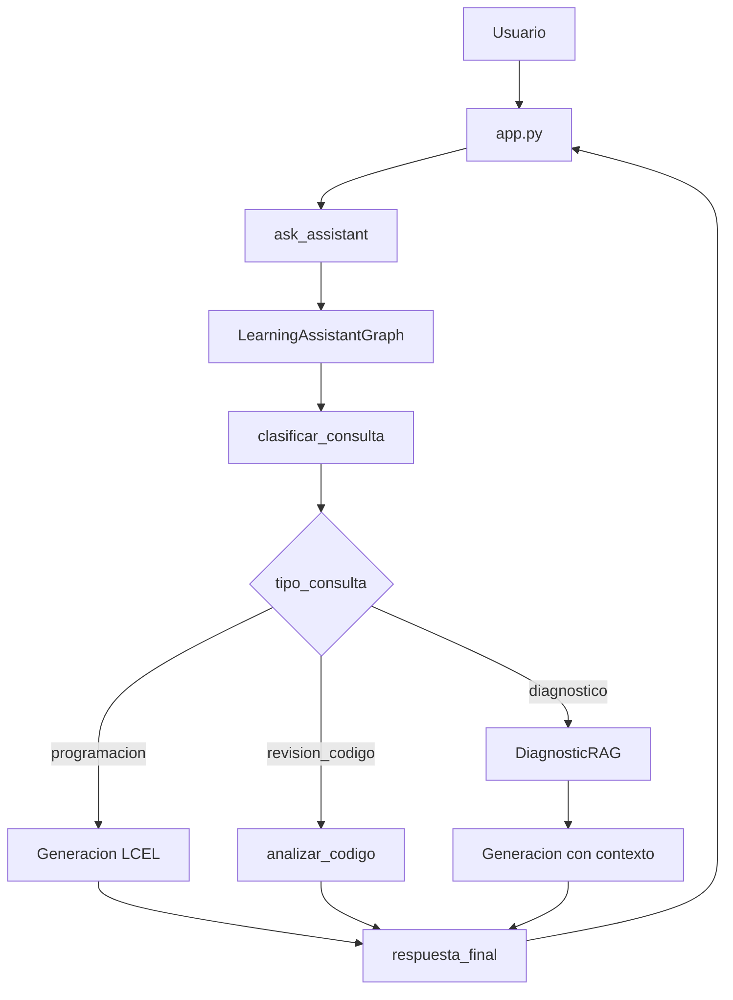

# Documentacion del Codigo

## 1. Descripcion general

El proyecto implementa un asistente educativo de programacion con interfaz en Streamlit, recuperacion RAG con ChromaDB y orquestacion mediante LangGraph. Su objetivo es apoyar a estudiantes mediante respuestas pedagogicas adaptadas al tono y modo de aprendizaje seleccionados.

Cuando la pregunta del usuario esta relacionada con el diagnostico educativo, el sistema recupera informacion desde un PDF indexado en ChromaDB. Cuando la pregunta es de programacion general o revision de codigo, el grafo dirige la consulta hacia nodos de generacion que no usan el diagnostico.

Tecnologias principales:

| Tecnologia | Uso |
| --- | --- |
| Python | Lenguaje principal del proyecto. |
| Streamlit | Interfaz web, chat y estado de sesion. |
| LangGraph | Orquestacion del flujo mediante nodos y estado compartido. |
| LangChain / LCEL | Composicion de prompts y cadena del modelo. |
| langchain-openai | Integracion con `ChatOpenAI` y `OpenAIEmbeddings`. |
| ChromaDB | Base vectorial local y persistente. |
| PyPDFLoader | Carga del PDF diagnostico. |
| RecursiveCharacterTextSplitter | Fragmentacion del documento en chunks. |

## 2. Estructura actual

```text
IA-Lanchaing/
|-- app.py
|-- README.md
|-- chroma_diagnostico/
|-- docs/
|   `-- Reporte_Ejecutivo_Encuesta_Programacion.pdf
|-- Documentacion/
|   |-- ARQUITECTURA_PROYECTO.md
|   `-- DOCUMENTACION_CODIGO.md
|-- Graphs/
|   |-- __init__.py
|   `-- learning_graph.py
|-- HU-docs/
|   |-- HU_Asistente_Educativo_RAG.md
|   `-- HU_Integracion_LangGraph_Asistente_Educativo.md
|-- Models/
|   `-- config.py
|-- Prompts/
|   `-- prompt.py
|-- Services/
|   |-- diagnostic_rag.py
|   |-- ejemplo_Asistente_IA.py
|   `-- setup_diagnostic_rag.py
`-- UI/
    `-- asistente.py
```

## 3. Punto de entrada

```bash
streamlit run app.py
```

Flujo general:

1. `app.py` configura la pagina.
2. Inicializa `st.session_state.messages`, `tono_asistente` y `modo_aprendizaje`.
3. Renderiza sidebar, chat y temas sugeridos.
4. Permite reconstruir el diagnostico con `DiagnosticDocumentProcessor.setup()`.
5. Recibe preguntas con `st.chat_input`.
6. Llama a `ask_assistant()` desde `UI/asistente.py`.
7. `ask_assistant()` invoca `LearningAssistantGraph`.
8. El grafo clasifica y enruta la consulta.
9. Se genera la respuesta final y se devuelven fuentes si aplica.
10. Streamlit guarda respuesta y ejecuta `st.rerun()`.

## 4. Documentacion por modulo

### `app.py`

Responsabilidad: manejar la interfaz de usuario.

Funciones locales:

| Funcion | Descripcion |
| --- | --- |
| `diagnostic_is_configured()` | Verifica si existe la ruta de Chroma configurada. |
| `configure_diagnostic()` | Ejecuta el procesamiento del PDF y reconstruye la base vectorial. |

Estado de sesion:

| Clave | Uso |
| --- | --- |
| `messages` | Historial de mensajes del chat. |
| `tono_asistente` | Tono seleccionado por el usuario. |
| `modo_aprendizaje` | Modo pedagogico seleccionado. |

### `UI/asistente.py`

Responsabilidad: adaptar la interfaz Streamlit al grafo de LangGraph.

| Funcion | Retorno | Descripcion |
| --- | --- | --- |
| `initialize_system()` | `LearningAssistantGraph` | Crea y cachea el grafo del asistente. Valida que Chroma tenga fragmentos. |
| `ask_assistant(question, tono, modo_aprendizaje)` | `(response, diagnostic_sources)` | Limpia la pregunta, invoca el grafo y devuelve respuesta/fuentes. |
| `get_assistant_info()` | `dict` | Devuelve metadatos publicos del asistente para la UI. |

Errores manejados:

- `FileNotFoundError`: base vectorial inexistente.
- `RuntimeError`: coleccion vectorial vacia.
- `Exception`: error general al procesar la consulta.

### `Graphs/learning_graph.py`

Responsabilidad: orquestar el flujo del asistente educativo con LangGraph.

Elementos principales:

| Elemento | Tipo | Descripcion |
| --- | --- | --- |
| `LearningAssistantState` | `TypedDict` | Estado compartido entre nodos del grafo. |
| `LearningAssistantGraph` | Clase | Construye modelo, prompt, cadena LCEL, RAG y grafo compilado. |
| `create_learning_assistant_graph()` | Funcion | Factory usada por `UI/asistente.py`. |

Estado:

| Campo | Descripcion |
| --- | --- |
| `question` | Pregunta limpia del usuario. |
| `tono` | Tono seleccionado en la UI. |
| `modo_aprendizaje` | Modo pedagogico seleccionado. |
| `tipo_consulta` | `diagnostico`, `programacion` o `revision_codigo`. |
| `contexto_diagnostico` | Contexto recuperado desde ChromaDB. |
| `fuentes` | Lista de fuentes recuperadas. |
| `respuesta` | Respuesta generada por el modelo. |
| `requiere_revision_codigo` | Bandera para consultas de revision de codigo. |
| `historial` | Trazas simples del flujo ejecutado. |

Nodos:

| Nodo | Descripcion |
| --- | --- |
| `clasificar_consulta` | Usa heuristicas para detectar diagnostico, programacion o revision de codigo. |
| `recuperar_diagnostico` | Ejecuta `DiagnosticRAG.get_context()` cuando la consulta requiere RAG. |
| `generar_respuesta_programacion` | Invoca la cadena sin contexto diagnostico. |
| `generar_respuesta_diagnostico` | Invoca la cadena con contexto recuperado desde ChromaDB. |
| `analizar_codigo` | Procesa revision de codigo como consulta de programacion especializada. |
| `respuesta_final` | Cierra el flujo y deja la respuesta lista para la UI. |

### `Services/diagnostic_rag.py`

Responsabilidad: recuperar informacion del diagnostico educativo desde ChromaDB.

Funciones auxiliares:

| Funcion | Descripcion |
| --- | --- |
| `normalize_text(text)` | Convierte a minusculas y elimina tildes. |
| `is_diagnostic_question(question)` | Detecta consultas relacionadas con diagnostico, encuesta, reporte o grupo. |
| `is_summary_question(question)` | Detecta solicitudes de resumen. |
| `main()` | Ejecuta pruebas manuales por consola. |

Metodos de `DiagnosticRAG`:

| Metodo | Descripcion |
| --- | --- |
| `__init__(chroma_path)` | Valida existencia de Chroma e inicializa embeddings y vectorstore. |
| `count_documents()` | Cuenta fragmentos almacenados. |
| `get_all_documents()` | Recupera todos los documentos para resumenes. Fue corregido para retornar todos los chunks. |
| `build_search_query(question)` | Construye una consulta enriquecida y define el tipo. |
| `retrieve(question)` | Recupera documentos segun tipo de consulta. |
| `format_context(documents)` | Convierte documentos recuperados en texto para el prompt. |
| `build_sources(documents)` | Deduplica fuentes por archivo y pagina. |
| `get_context(question)` | API principal usada por el nodo `recuperar_diagnostico`. |

### `Services/setup_diagnostic_rag.py`

Responsabilidad: construir la base vectorial del diagnostico.

| Metodo | Descripcion |
| --- | --- |
| `validate_pdf()` | Verifica que el archivo exista y sea `.pdf`. |
| `load_document()` | Carga paginas con `PyPDFLoader` y agrega metadata. |
| `split_documents(documents)` | Divide paginas en chunks con overlap. |
| `remove_existing_vectorstore()` | Elimina el indice anterior para evitar duplicados. |
| `create_vectorstore(chunks)` | Crea la coleccion Chroma desde los chunks. |
| `setup()` | Ejecuta el flujo completo. |

### `Models/config.py`

Responsabilidad: centralizar configuracion.

| Constante | Valor |
| --- | --- |
| `BASE_DIR` | Raiz del proyecto. |
| `DOCS_DIR` | Carpeta `docs/`. |
| `DIAGNOSTIC_CHROMA_PATH` | Carpeta `chroma_diagnostico/`. |
| `MODEL_NAME` | `gpt-4o-mini` |
| `EMBEDDINGS_MODEL` | `text-embedding-3-small` |
| `TEMPERATURE` | `0.3` |
| `RETRIEVAL_K` | `2` |
| `DIAGNOSTIC_COLLECTION_NAME` | `student_diagnostic` |

### `Prompts/prompt.py`

Responsabilidad: definir `PROGRAMMING_TEMPLATE`.

Variables requeridas:

| Variable | Descripcion |
| --- | --- |
| `tono` | Estilo de comunicacion seleccionado. |
| `modo_aprendizaje` | Estrategia pedagogica seleccionada. |
| `tipo_consulta` | Puede ser `diagnostico` o `programacion`. |
| `contexto_diagnostico` | Fragmentos recuperados desde ChromaDB. |
| `question` | Pregunta del usuario. |

### `Services/ejemplo_Asistente_IA.py`

Responsabilidad: ejemplo o version previa del asistente.

Observaciones:

- No esta importado por `app.py`.
- Define funciones con errores tipograficos: `ask_assistent()` y `get_assitent_info()`.
- Invoca `PROGRAMMING_TEMPLATE` sin enviar `tipo_consulta` ni `contexto_diagnostico`.
- Si se ejecuta con el prompt actual, puede fallar por variables faltantes.

## 5. Flujo de datos



## 6. Comandos utiles

Procesar o reconstruir el diagnostico:

```bash
python -m Services.setup_diagnostic_rag
```

Ejecutar la aplicacion:

```bash
streamlit run app.py
```

Probar recuperacion RAG por consola:

```bash
python -m Services.diagnostic_rag
```

Validar sintaxis de los archivos principales:

```bash
python -m py_compile Graphs\learning_graph.py UI\asistente.py Services\diagnostic_rag.py
```

## 7. Pruebas recomendadas

- `normalize_text()` elimina tildes correctamente.
- `is_diagnostic_question()` clasifica preguntas del diagnostico.
- `is_summary_question()` detecta resumenes.
- `get_all_documents()` devuelve todos los chunks.
- `clasificar_consulta` enruta diagnostico, programacion y revision de codigo.
- `ask_assistant()` responde adecuadamente ante pregunta vacia.
- `ask_assistant()` maneja base vectorial inexistente.

## 8. Hallazgos y mejoras recomendadas

| Prioridad | Hallazgo | Recomendacion |
| --- | --- | --- |
| Alta | No hay pruebas del grafo. | Agregar tests para nodos y rutas condicionales. |
| Media | Hay textos con codificacion incorrecta. | Guardar archivos como UTF-8 y corregir literales. |
| Media | No hay archivo de dependencias. | Crear `requirements.txt` o `pyproject.toml`. |
| Media | `diagnostic_is_configured()` solo revisa carpeta. | Validar conteo real de documentos en ChromaDB. |
| Baja | Imports wildcard en `app.py`. | Reemplazar por imports explicitos. |
| Baja | Codigo legado en `Services/ejemplo_Asistente_IA.py`. | Actualizarlo o retirarlo. |
