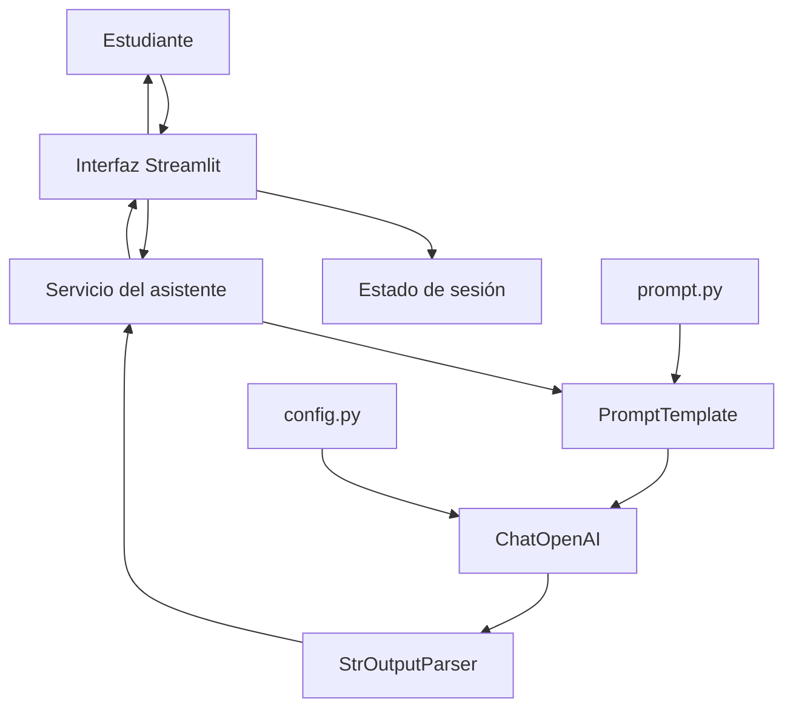
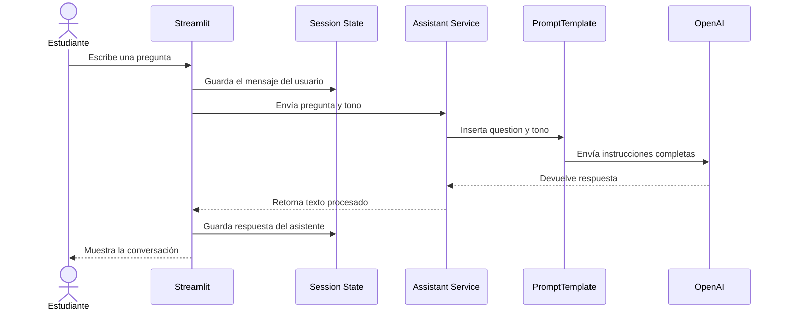

# Arquitectura del Asistente Educativo de Programación

## 1. Descripción general

El proyecto implementa un asistente educativo de programación utilizando **Streamlit**, **LangChain** y un modelo de **OpenAI**.

La aplicación permite que el estudiante:

- Seleccione el tono de respuesta del asistente.
- Escriba preguntas relacionadas con programación.
- Reciba respuestas educativas generadas por inteligencia artificial.
- Visualice el historial del chat durante la sesión.
- Limpie la conversación cuando lo necesite.

La arquitectura está separada en cuatro componentes principales:

1. **Interfaz de usuario**
2. **Plantilla de instrucciones**
3. **Servicio del asistente**
4. **Configuración del modelo**

---

## 2. Estructura sugerida del proyecto

```text
asistente-programacion/
│
├── app.py
├── assistant_service.py
├── prompt.py
├── config.py
├── requirements.txt
├── .env
└── README.md
```

### Función de cada archivo

| Archivo | Responsabilidad |
|---|---|
| `app.py` | Construye la interfaz con Streamlit, recibe preguntas y muestra respuestas. |
| `assistant_service.py` | Inicializa el modelo, crea la cadena de LangChain y procesa las consultas. |
| `prompt.py` | Contiene la plantilla educativa utilizada para orientar al modelo. |
| `config.py` | Guarda el nombre del modelo y la temperatura. |
| `.env` | Almacena variables privadas, como la clave de OpenAI. |
| `requirements.txt` | Contiene las dependencias necesarias para ejecutar el proyecto. |
| `README.md` | Explica cómo instalar y utilizar la aplicación. |

> Los nombres de los archivos pueden cambiar. Esta estructura se propone a partir de las responsabilidades observadas en el código.

---

## 3. Diagrama general de arquitectura



---

## 4. Arquitectura por capas

### 4.1. Capa de presentación

**Archivo sugerido:** `app.py`

Esta capa contiene todo lo que el usuario ve y utiliza.

Sus responsabilidades son:

- Mostrar el selector de tono.
- Mostrar la descripción del tono seleccionado.
- Presentar el historial de mensajes.
- Mostrar los temas sugeridos.
- Recibir la pregunta del estudiante.
- Mostrar un indicador mientras se genera la respuesta.
- Mostrar la respuesta del asistente.
- Permitir limpiar el chat.

Fragmentos principales:

```python
tono_opcion = st.selectbox(...)
```

Crea la lista desplegable para seleccionar el tono.

```python
st.chat_input("Escribe tu pregunta sobre programación...")
```

Recibe la pregunta del estudiante.

```python
with st.chat_message(message["role"]):
    st.markdown(message["content"])
```

Muestra cada mensaje de acuerdo con su autor.

```python
response = ask_assistent(
    prompt,
    st.session_state.tono_asistente
)
```

Envía la pregunta y el tono a la capa encargada de comunicarse con el modelo.

---

### 4.2. Capa de estado de la aplicación

**Tecnología utilizada:** `st.session_state`

Streamlit vuelve a ejecutar el archivo principal cada vez que ocurre una interacción. Por esta razón, se utiliza `st.session_state` para conservar información durante la sesión.

Variables principales:

| Variable | Contenido |
|---|---|
| `st.session_state.messages` | Lista con los mensajes del usuario y del asistente. |
| `st.session_state.tono_asistente` | Tono actualmente seleccionado. |

Ejemplo de un mensaje:

```python
{
    "role": "user",
    "content": "¿Qué es una variable?"
}
```

Ejemplo de una respuesta:

```python
{
    "role": "assistant",
    "content": "Una variable es un espacio donde se guarda información."
}
```

Inicialización recomendada:

```python
if "messages" not in st.session_state:
    st.session_state.messages = []

if "tono_asistente" not in st.session_state:
    st.session_state.tono_asistente = "Útil y amigable"
```

---

### 4.3. Capa de instrucciones del modelo

**Archivo sugerido:** `prompt.py`

Esta capa define el comportamiento del asistente mediante `PROGRAMMING_TEMPLATE`.

La plantilla indica:

- El rol del asistente.
- El objetivo educativo.
- El tono seleccionado.
- Los temas que puede enseñar.
- La forma en que debe explicar.
- La pregunta realizada por el estudiante.

Variables dinámicas:

```text
{tono}
{question}
```

Ejemplo de sustitución:

```text
TONO DEL ASISTENTE:
Creativo y divertido

PREGUNTA DEL ESTUDIANTE:
¿Qué es un ciclo for?
```

La plantilla permite modificar el comportamiento del asistente sin cambiar la lógica de la aplicación.

---

### 4.4. Capa de servicio del asistente

**Archivo sugerido:** `assistant_service.py`

Esta capa conecta la interfaz con el modelo de lenguaje.

Sus responsabilidades son:

- Crear la instancia de `ChatOpenAI`.
- Convertir el texto de instrucciones en un `PromptTemplate`.
- Construir la cadena de LangChain.
- Ejecutar la consulta.
- Convertir la respuesta a texto.
- Manejar errores.

Inicialización del modelo:

```python
llm = ChatOpenAI(
    model_name=MODEL_NAME,
    temperature=TEMPERATURE
)
```

Creación de la plantilla:

```python
prompt = PromptTemplate.from_template(PROGRAMMING_TEMPLATE)
```

Construcción de la cadena:

```python
chain = (
    prompt
    | llm
    | StrOutputParser()
)
```

La cadena procesa la información en este orden:

```text
Pregunta y tono
      ↓
PromptTemplate
      ↓
Modelo de OpenAI
      ↓
StrOutputParser
      ↓
Respuesta en texto
```

---

### 4.5. Capa de configuración

**Archivo sugerido:** `config.py`

Esta capa almacena valores que pueden cambiar sin modificar la lógica principal.

```python
MODEL_NAME = "gpt-4o-mini"
TEMPERATURE = 0.7
```

| Configuración | Función |
|---|---|
| `MODEL_NAME` | Selecciona el modelo que responderá las preguntas. |
| `TEMPERATURE` | Controla la variación y creatividad de las respuestas. |

Una temperatura cercana a `0` produce respuestas más estables y directas. Una temperatura más alta produce respuestas más variadas y creativas.

---

## 5. Flujo completo de una consulta



### Flujo explicado paso a paso

1. El estudiante selecciona un tono.
2. El tono se guarda en `st.session_state.tono_asistente`.
3. El estudiante escribe una pregunta.
4. La pregunta se guarda en `st.session_state.messages`.
5. La interfaz llama a `ask_assistent()`.
6. `ask_assistent()` obtiene la cadena creada por `initialize_system()`.
7. La cadena inserta la pregunta y el tono dentro de `PROGRAMMING_TEMPLATE`.
8. El modelo de OpenAI genera una respuesta.
9. `StrOutputParser` convierte el resultado en texto.
10. La respuesta se guarda en el historial.
11. `st.rerun()` actualiza la interfaz.
12. Streamlit muestra la pregunta y la respuesta.

---

## 6. Uso de caché

La función encargada de construir la cadena utiliza:

```python
@st.cache_resource
def initialize_system():
```

Esto evita crear nuevamente el modelo y la cadena cada vez que Streamlit recarga la aplicación.

Sin caché:

```text
Interacción → crear modelo → crear cadena → responder
Interacción → crear modelo → crear cadena → responder
```

Con caché:

```text
Primera interacción → crear modelo y cadena
Siguientes interacciones → reutilizar modelo y cadena
```

---

## 7. Manejo de errores

La función `ask_assistent()` utiliza un bloque `try-except`:

```python
try:
    chain = initialize_system()

    response = chain.invoke({
        "question": question,
        "tono": tono
    })

    return response

except Exception as e:
    return f"Error al procesar la solicitud: {str(e)}"
```

Esto evita que la aplicación se cierre si ocurre un problema.

Algunos errores posibles son:

- Clave de OpenAI inexistente.
- Conexión a internet no disponible.
- Nombre de modelo incorrecto.
- Límite de uso de la API.
- Variables de la plantilla incompletas.

---

## 8. Tecnologías utilizadas

| Tecnología | Uso |
|---|---|
| Python | Lenguaje principal del proyecto. |
| Streamlit | Construcción de la interfaz web. |
| LangChain | Organización del prompt y la cadena de procesamiento. |
| OpenAI | Generación de respuestas educativas. |
| PromptTemplate | Inserción del tono y la pregunta en las instrucciones. |
| StrOutputParser | Conversión de la salida del modelo a texto. |

---

## 9. Alcance de la primera fase

En esta primera fase se incluyen las siguientes funcionalidades:

- Interfaz básica de chat.
- Selección del tono del asistente.
- Descripción de cada tono.
- Temas sugeridos.
- Historial visual durante la sesión.
- Botón para limpiar el chat.
- Plantilla educativa.
- Conexión con OpenAI mediante LangChain.
- Configuración del modelo y la temperatura.
- Manejo básico de errores.

---

## 10. Limitaciones actuales

### 10.1. El modelo no recibe el historial completo

Los mensajes se guardan para mostrarlos en pantalla, pero solamente se envían al modelo la pregunta actual y el tono.

```python
response = ask_assistent(
    prompt,
    st.session_state.tono_asistente
)
```

Por esta razón, el modelo no recuerda realmente el contexto anterior.

### 10.2. El historial se pierde al cerrar la sesión

`st.session_state` conserva los mensajes mientras la sesión está activa, pero no los guarda de forma permanente.

### 10.3. No existe una base de datos

La aplicación todavía no almacena:

- Usuarios.
- Conversaciones.
- Preguntas frecuentes.
- Progreso del estudiante.
- Resultados de ejercicios.

### 10.4. La clave de la API debe protegerse

La clave de OpenAI no debe escribirse directamente en el código ni subirse al repositorio.

Ejemplo recomendado en `.env`:

```env
OPENAI_API_KEY=tu_clave_privada
```

El archivo `.env` debe agregarse a `.gitignore`.

---

## 11. Mejoras recomendadas para siguientes fases

- Agregar memoria conversacional.
- Guardar las conversaciones en una base de datos.
- Crear autenticación de estudiantes.
- Agregar niveles de dificultad.
- Permitir seleccionar el lenguaje de programación.
- Generar ejercicios personalizados.
- Evaluar las respuestas del estudiante.
- Mostrar el progreso de aprendizaje.
- Agregar pruebas automatizadas.
- Organizar las importaciones sin utilizar `*`.
- Corregir los nombres `ask_assistent` y `get_assitent_info` por `ask_assistant` y `get_assistant_info`.

---

## 12. Resumen de responsabilidades

```text
app.py
├── Construye la interfaz
├── Gestiona el estado de sesión
├── Recibe las preguntas
├── Muestra los mensajes
└── Llama al servicio del asistente

assistant_service.py
├── Inicializa el modelo
├── Construye la cadena de LangChain
├── Ejecuta las consultas
└── Maneja errores

prompt.py
└── Define las instrucciones educativas del asistente

config.py
├── Define el modelo
└── Define la temperatura
```

---

## 13. Conclusión

La aplicación utiliza una arquitectura modular sencilla en la que la interfaz, las instrucciones, la conexión con el modelo y la configuración se encuentran separadas.

Esta organización facilita:

- Comprender el código.
- Modificar cada componente.
- Detectar errores.
- Agregar nuevas funciones.
- Escalar el proyecto en futuras historias de usuario.
