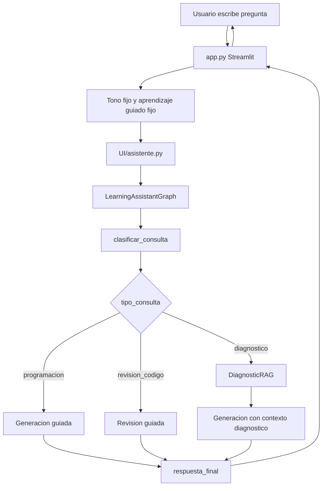

# HU-004 - Aprendizaje guiado, tono fijo, paleta visual y dependencias

## 1. Resumen de la version

En la version 04 se ajusto el asistente educativo para que su comportamiento principal sea guiar al estudiante paso a paso, en lugar de entregar respuestas completas de inmediato. Tambien se simplifico la interfaz quitando la seleccion de tono y de modo de aprendizaje, se incorporo una paleta visual definida por el usuario y se documento el conjunto de dependencias necesarias para instalar el proyecto.

Esta version cambia el enfoque del producto: el asistente deja de ser una herramienta configurable por estilos y pasa a ser un tutor guiado con una experiencia mas consistente. La decision busca que el estudiante aprenda el proceso de razonamiento y no solo copie la respuesta final.

## 2. Objetivo funcional

Como estudiante que esta aprendiendo programacion, necesito que el asistente me ayude de forma guiada para comprender como resolver un problema, dejando espacio para pensar y practicar antes de recibir una solucion completa.

El objetivo de la version 04 es que el asistente:

- Desglose los problemas en pasos pequenos.
- Explique el razonamiento detras de cada paso.
- Se detenga despues del primer avance para que el estudiante trabaje.
- Use pistas progresivas cuando el estudiante se atasque.
- Evite entregar la respuesta final de inmediato.
- Mantenga un tono normal, claro y amigable sin pedir configuracion al usuario.
- Use una identidad visual coherente con la paleta de colores solicitada.
- Cuente con un archivo de dependencias para facilitar instalacion.

## 3. Cambios implementados

### 3.1 Eliminacion del selector de tono

Se elimino de `app.py` la configuracion de `st.session_state.tono_asistente`, el diccionario de tonos, el `selectbox` de tono y la descripcion dinamica asociada.

Ahora el asistente usa una constante interna:

```python
DEFAULT_ASSISTANT_TONE = "Normal, claro y amigable"
```

Justificacion:

- El objetivo de la version 04 es reducir decisiones innecesarias para el estudiante.
- Un tono fijo ayuda a que la experiencia sea mas predecible.
- El asistente educativo necesita priorizar claridad, cercania y normalidad, no variaciones de estilo.
- Se evita que un tono demasiado tecnico, formal o creativo interfiera con el aprendizaje guiado.

### 3.2 Eliminacion del selector de modo de aprendizaje

Se retiro el selector de modos que permitia escoger entre:

- Aprendizaje guiado.
- Explicacion conceptual.
- Revision de codigo.
- Solucion de referencia.

Ahora `app.py` envia siempre:

```python
DEFAULT_LEARNING_MODE = "Aprendizaje guiado"
```

En la barra lateral ya no se muestra un control editable, sino una descripcion fija del modo:

```text
Aprendizaje guiado: el asistente orienta paso a paso con preguntas y pistas, sin entregar la solucion completa de inmediato.
```

Justificacion:

- La version 04 define el aprendizaje guiado como comportamiento obligatorio.
- El modo "Solucion de referencia" entraba en conflicto con la nueva intencion pedagogica.
- Al quitar el selector, la interfaz comunica con mas claridad que el sistema esta disenado para ensenar el proceso, no para resolver automaticamente.
- La aplicacion queda mas simple para estudiantes principiantes.

### 3.3 Refuerzo del prompt pedagogico

Se modifico `Prompts/prompt.py` para que `PROGRAMMING_TEMPLATE` incluya reglas explicitas de guia.

El prompt ahora indica que el asistente debe:

- Actuar como guia, no como solucionador directo.
- Desglosar el problema paso a paso.
- Explicar el razonamiento de cada paso.
- Presentar solo el primer paso necesario para avanzar.
- Detenerse y pedir al estudiante que intente resolver esa parte.
- Empezar con una pregunta clarificadora si falta contexto.
- No revelar la conclusion, respuesta final o codigo completo de inmediato.
- Ofrecer pistas sutiles si el estudiante se atasca.
- Guiar hasta que el estudiante pueda completar el ultimo paso por su cuenta.

Justificacion:

- La UI por si sola no garantiza el comportamiento pedagogico; el prompt tambien debe expresar esa regla.
- El modelo necesita instrucciones claras para no responder con soluciones completas cuando el usuario las pida.
- Las reglas hacen que las consultas conceptuales, los ejercicios y las revisiones de codigo sigan el mismo principio educativo.
- Se conserva la separacion entre consultas de programacion y consultas del diagnostico.

### 3.4 Incorporacion y ajuste de la paleta visual

Se agrego un bloque CSS en `app.py` tomando como base la paleta solicitada. Luego se ajusto la aplicacion para que los elementos visibles usen una gama mas uniforme, centrada en azul, celeste y menta.

| Color | Uso principal |
| --- | --- |
| `#95D1DC` | Acentos, bordes y mensajes del chat. |
| `#E7F0EA` | Fondo general y sidebar. |
| `#1A77A3` | Titulos, botones y footer. |
| `#155F82` | Hover de botones dentro de la misma familia azul. |
| `#F7FBFA` | Superficie clara para fondo, header, contenedor inferior y entrada del chat. |

El CSS aplica la paleta a:

- Fondo principal de Streamlit.
- Header superior de Streamlit.
- Sidebar.
- Titulos.
- Botones.
- Alertas informativas.
- Mensajes del chat.
- Entrada del chat.
- Contenedor fijo inferior donde Streamlit ubica la entrada del chat.
- Footer.

Justificacion:

- La paleta le da identidad visual al asistente sin cambiar su arquitectura funcional.
- Los tonos suaves reducen carga visual y hacen que la interfaz se sienta mas educativa.
- El azul funciona como color principal de confianza y navegacion.
- Se retiraron los acentos coral y amarillo de los elementos visibles porque generaban contraste innecesario en la barra de busqueda y en la parte superior de la interfaz.
- La barra de busqueda, el header, el contenedor inferior fijo y los estados de hover quedaron dentro de una misma familia cromatica para lograr una experiencia mas limpia y consistente.

### 3.5 Archivo de dependencias

Se creo `Requirements/requirements.txt` con las dependencias directas del proyecto:

- `streamlit`
- `langchain`
- `langchain-community`
- `langchain-core`
- `langchain-openai`
- `langchain-text-splitters`
- `langgraph`
- `chromadb`
- `openai`
- `tiktoken`
- `pypdf`

Justificacion:

- El proyecto no tenia una declaracion clara de dependencias.
- El archivo facilita instalar el entorno en otra maquina.
- Se documentan dependencias directas, no paquetes transitivos del entorno virtual.
- La ruta `Requirements/requirements.txt` separa la instalacion del codigo fuente.

## 4. Archivos modificados o creados

| Archivo | Cambio |
| --- | --- |
| `app.py` | Tono fijo, modo guiado fijo, eliminacion de selectores, CSS con paleta visual. |
| `Prompts/prompt.py` | Reglas pedagogicas reforzadas para aprendizaje guiado. |
| `Requirements/requirements.txt` | Dependencias necesarias para instalar el proyecto. |
| `HU-docs/HU_04.md` | Documentacion de la version 04. |
| `README.md` | Actualizacion de descripcion, funcionalidades, estructura, ejecucion y estado. |
| `Documentacion/DOCUMENTACION_CODIGO.md` | Actualizacion tecnica por modulo y comportamiento actual. |
| `Documentacion/ARQUITECTURA_PROYECTO.md` | Arquitectura actualizada para reflejar V04. |

## 5. Flujo actual despues de la version 04



## 6. Criterios de aceptacion cubiertos

| Criterio | Estado |
| --- | --- |
| El usuario no debe escoger tono. | Cumplido |
| El asistente debe usar un tono normal, claro y amigable. | Cumplido |
| El usuario no debe escoger modo de aprendizaje. | Cumplido |
| El asistente debe funcionar siempre en aprendizaje guiado. | Cumplido |
| El prompt debe impedir respuestas completas inmediatas. | Cumplido |
| El asistente debe pedir al estudiante que trabaje cada paso. | Cumplido |
| La interfaz debe incorporar la paleta solicitada. | Cumplido |
| El proyecto debe incluir dependencias instalables. | Cumplido |
| La documentacion debe reflejar la version actual. | Cumplido en esta HU y documentos actualizados. |

## 7. Decisiones de diseno

### Mantener el parametro `tono`

Aunque el usuario ya no selecciona tono, se mantuvo el parametro `tono` al invocar `ask_assistant()`.

Razon:

- Evita modificar la firma de `ask_assistant()` y `LearningAssistantGraph.invoke()`.
- Reduce el impacto en `UI/asistente.py` y `Graphs/learning_graph.py`.
- Mantiene compatibilidad con el prompt actual.
- Permite volver a introducir configuracion de tono en el futuro si fuera necesario, sin reescribir la arquitectura.

### Mantener el parametro `modo_aprendizaje`

Aunque el modo ya no es configurable, se sigue enviando `Aprendizaje guiado`.

Razon:

- El grafo y el prompt ya esperaban esta variable.
- El cambio queda acotado a la capa de UI y al prompt.
- La arquitectura mantiene una separacion clara entre interfaz, orquestacion y generacion.
- El sistema puede seguir usando el campo para trazabilidad del flujo pedagogico.

### Aplicar colores mediante CSS dentro de `app.py`

Razon:

- Streamlit permite inyectar CSS rapidamente con `st.markdown`.
- No se introdujo una nueva dependencia ni un sistema de temas externo.
- El cambio visual queda centralizado en el punto de entrada de la UI.
- Es suficiente para el alcance de una aplicacion academica local.

## 8. Impacto en la arquitectura

La version 04 no cambia la arquitectura base de IA: se conserva Streamlit, LangGraph, LangChain, OpenAI y ChromaDB.

El cambio arquitectonico principal ocurre en la capa de experiencia:

- `app.py` deja de exponer configuraciones variables de tono y modo.
- `app.py` se convierte en una interfaz guiada con constantes pedagogicas.
- `Prompts/prompt.py` asume que el objetivo central es guiar el razonamiento.
- `UI/asistente.py` y `Graphs/learning_graph.py` se mantienen estables, recibiendo los mismos parametros.

Esto es intencional: se logro cambiar el comportamiento pedagogico sin romper el grafo ni la capa RAG.

## 9. Validacion realizada

Se valido la sintaxis de los archivos modificados con:

```bash
python3 -m py_compile app.py Prompts/prompt.py
```

Para evitar problemas de permisos con la cache de Python en macOS, se uso `PYTHONPYCACHEPREFIX` apuntando a `/private/tmp`.

## 10. Pendientes recomendados

- Mostrar las fuentes diagnosticas recuperadas en el chat.
- Cambiar imports wildcard por imports explicitos.
- Agregar pruebas automatizadas para el prompt esperado y la clasificacion del grafo.
- Validar en el sidebar que ChromaDB tenga documentos, no solo que exista la carpeta.
- Revisar si `Services/ejemplo_Asistente_IA.py` debe eliminarse o actualizarse.
- Evaluar mover el CSS a un modulo propio si la interfaz sigue creciendo.
