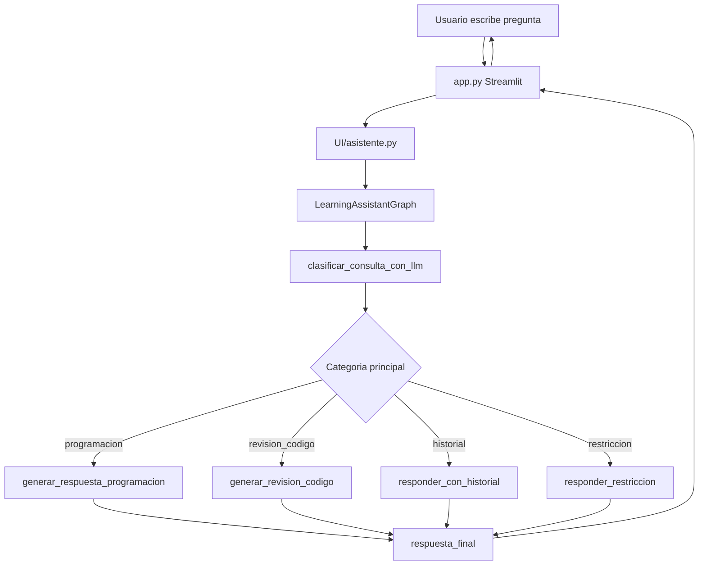

# HU-005 - Clasificacion con LLM, memoria conversacional y restriccion de dominio

## 1. Resumen de la version

En la version 05 se propone modificar el asistente educativo para eliminar el flujo de diagnostico/RAG y reemplazar la clasificacion basada en reglas por una clasificacion realizada con un LLM.

El sistema dejara de usar el PDF diagnostico, ChromaDB y los nodos asociados al diagnostico. En su lugar, el asistente se enfocara exclusivamente en programacion, revision de codigo, memoria conversacional temporal e interacciones fuera de dominio.

La nueva clasificacion tendra cuatro categorias principales:

- `programacion`
- `revision_codigo`
- `historial`
- `restriccion`

La clasificacion se realizara con un LLM para entender mejor la intencion del usuario, incluso cuando existan errores de escritura, sinonimos, frases ambiguas o preguntas que dependan del historial conversacional.

## 2. Objetivo funcional

Como estudiante que esta aprendiendo programacion, necesito que el asistente pueda identificar correctamente el tipo de consulta que realizo, recordar informacion relevante de la conversacion actual y rechazar amablemente preguntas que no esten relacionadas con programacion.

El objetivo de esta version es que el asistente:

- Use un LLM para clasificar la intencion del usuario.
- Atienda consultas conceptuales de programacion.
- Atienda consultas de revision de codigo.
- Responda preguntas relacionadas con el historial de la conversacion.
- Rechace de forma amable preguntas fuera del dominio de programacion.
- Mantenga el enfoque de aprendizaje guiado.
- Use memoria temporal durante la sesion activa.
- Elimine dependencias y flujo de diagnostico/RAG que ya no seran utilizados.

## 3. Clasificaciones propuestas

| Categoria | Uso | Ejemplos |
| --- | --- | --- |
| `programacion` | Preguntas conceptuales, teoricas o practicas sobre programacion. | `Que es una variable?`, `Como funciona un for?`, `Explicame funciones en Python`. |
| `revision_codigo` | Consultas donde el usuario comparte codigo, errores, traceback o pide corregir/analizar codigo. | `Revisa este codigo`, `Por que falla este print?`, `Tengo un SyntaxError`. |
| `historial` | Preguntas o mensajes que dependen de recordar informacion previa de la conversacion. | `Cual es mi nombre?`, `Que te pregunte antes?`, `Retomemos el ejercicio anterior`. |
| `restriccion` | Preguntas fuera de programacion o que no dependan del historial conversacional del aprendizaje. | `Dame una receta`, `Cual es la capital de Francia?`, `Hazme una rutina de gimnasio`. |

## 4. Regla para consultas con varias intenciones

Para esta version se usara una sola categoria principal por consulta.

Si el usuario envia una consulta compuesta, el clasificador debe elegir la categoria que requiera el flujo mas especifico.

Prioridad propuesta:

1. `revision_codigo`: si hay codigo, error, traceback, ejercicio concreto o solicitud de analisis tecnico.
2. `historial`: si la consulta depende claramente de informacion previa de la conversacion.
3. `programacion`: si la consulta es conceptual o practica sobre programacion.
4. `restriccion`: si no esta relacionada con programacion ni con la memoria conversacional del asistente.

Ejemplo:

```text
Explicame que es una variable y revisa este codigo: print("hola"
```

Categoria principal esperada:

```text
revision_codigo
```

Justificacion:

- La consulta incluye una explicacion conceptual.
- Pero tambien incluye una revision de codigo concreta.
- La revision de codigo requiere el flujo mas especifico.
- El nodo de revision puede explicar primero el concepto minimo necesario y luego guiar el analisis del codigo.

## 5. Flujo propuesto



## 6. Memoria conversacional propuesta

La memoria sera temporal y estara asociada a la sesion activa.

Se propone usar el patron aprendido en el Tema 5:

- `RunnableWithMessageHistory`
- `InMemoryChatMessageHistory`
- `MessagesPlaceholder`
- `session_id`

La memoria permitira responder preguntas como:

```text
Me llamo Carlos.
```

Luego:

```text
Cual es mi nombre?
```

Respuesta esperada:

```text
Me dijiste que te llamas Carlos.
```

## 7. Fuera de alcance

No se implementara en esta version:

- Memoria persistente en base de datos.
- SQLite.
- Checkpointing de LangGraph.
- Usuarios autenticados.
- Historial entre sesiones cerradas.
- RAG diagnostico.
- ChromaDB.
- Lectura del PDF diagnostico.
- Busqueda semantica documental.
- Descomposicion avanzada de multiples preguntas.

La descomposicion de consultas en varias subpreguntas se deja como mejora futura.

## 8. Cambios esperados

### 8.1 Eliminacion del diagnostico/RAG

Se dejara de utilizar:

- `docs/`
- `chroma_diagnostico/`
- `Services/diagnostic_rag.py`
- `Services/setup_diagnostic_rag.py`
- Nodos de recuperacion diagnostica.
- Variables de configuracion asociadas al PDF y ChromaDB.
- Dependencias que solo eran necesarias para RAG documental, si ya no se usan.

### 8.2 Nuevo clasificador con LLM

El nodo `clasificar_consulta` se reemplazara o modificara para usar un LLM.

El clasificador debera devolver exclusivamente una de estas categorias:

```text
programacion
revision_codigo
historial
restriccion
```

Si el LLM devuelve una categoria no valida, el sistema debera usar una categoria segura, preferiblemente:

```text
restriccion
```

### 8.3 Nuevos nodos del grafo

| Nodo | Responsabilidad |
| --- | --- |
| `clasificar_consulta_con_llm` | Clasificar la intencion principal del usuario usando el modelo. |
| `generar_respuesta_programacion` | Responder consultas de programacion con aprendizaje guiado. |
| `generar_revision_codigo` | Revisar codigo o errores de forma guiada, sin entregar solucion completa inmediatamente. |
| `responder_con_historial` | Responder preguntas que dependen de la memoria conversacional temporal. |
| `responder_restriccion` | Responder amablemente que el asistente solo atiende temas de programacion. |
| `respuesta_final` | Preparar la respuesta final para Streamlit. |

### 8.4 Ajustes al prompt

El prompt principal debera incluir:

- Rol de tutor de programacion.
- Reglas de aprendizaje guiado.
- Restriccion de dominio.
- Instrucciones para responder usando historial cuando aplique.
- `MessagesPlaceholder` para insertar memoria conversacional.

## 9. Criterios de aceptacion

| Criterio | Resultado esperado |
| --- | --- |
| Una pregunta conceptual de programacion se clasifica como `programacion`. | El asistente responde con explicacion guiada. |
| Una consulta con codigo o error se clasifica como `revision_codigo`. | El asistente analiza el codigo con pistas y pasos. |
| Una pregunta sobre informacion previa se clasifica como `historial`. | El asistente responde usando la memoria de la sesion. |
| Una pregunta fuera de programacion se clasifica como `restriccion`. | El asistente rechaza amablemente la solicitud. |
| Una consulta compuesta se clasifica con una categoria principal. | Se usa la prioridad definida para elegir la ruta. |
| El asistente conserva memoria durante la sesion activa. | Puede recordar datos mencionados previamente. |
| Al cerrar o reiniciar la app, la memoria puede perderse. | Comportamiento aceptado porque no hay persistencia. |
| El flujo de diagnostico/RAG deja de utilizarse. | No se consulta ChromaDB ni PDF diagnostico. |

## 10. Casos de prueba sugeridos

| Entrada | Categoria esperada |
| --- | --- |
| `Que es una variable?` | `programacion` |
| `Como funciona un ciclo for?` | `programacion` |
| `Revisa este codigo: print("hola"` | `revision_codigo` |
| `Tengo este error SyntaxError` | `revision_codigo` |
| `Me llamo Carlos` | `historial` |
| `Cual es mi nombre?` | `historial` |
| `Que te pregunte antes?` | `historial` |
| `Dame una receta de pasta` | `restriccion` |
| `Cual es la capital de Francia?` | `restriccion` |
| `Explicame que es una variable y revisa este codigo: x =` | `revision_codigo` |

## 11. Impacto en la arquitectura

La version 05 cambia el foco del proyecto:

Antes:

```text
Asistente educativo con RAG diagnostico
```

Despues:

```text
Asistente educativo de programacion con memoria conversacional y clasificacion por LLM
```

El cambio simplifica la arquitectura documental al retirar RAG, pero aumenta la capacidad conversacional del asistente mediante memoria temporal y clasificacion semantica.

## 12. Pendientes posteriores

- Evaluar salida estructurada para el clasificador.
- Agregar pruebas automatizadas del clasificador.
- Agregar pruebas para memoria conversacional.
- Evaluar memoria persistente con SQLite en una HU futura.
- Agregar descomposicion de consultas compuestas en subpreguntas.
- Actualizar README y documentacion tecnica despues de implementar la HU.
