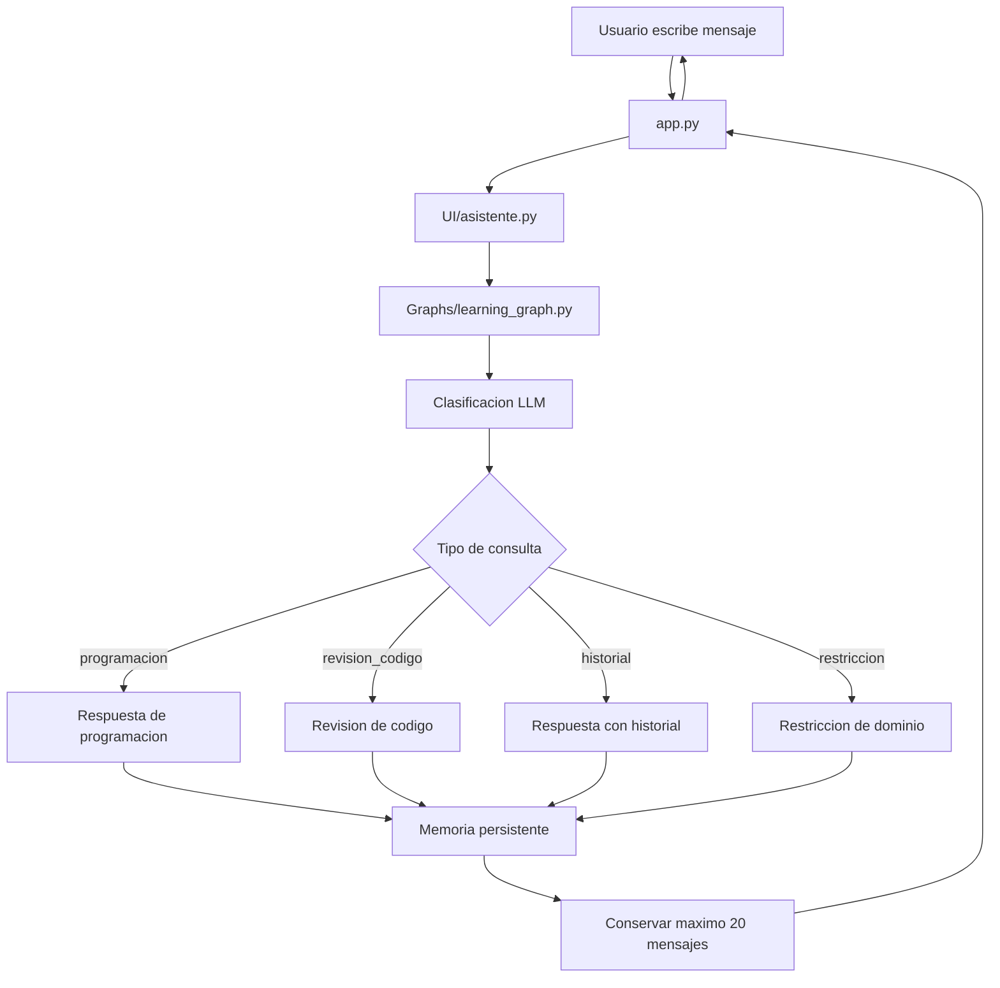

# HU-006 - Memoria persistente con limite de historial conversacional

## 1. Resumen de la version

En la version 06 se propone evolucionar la memoria del asistente educativo para que deje de depender unicamente de la memoria temporal en RAM y pueda conservar el historial conversacional de forma persistente.

Esta HU combina dos necesidades:

- Persistir la conversacion por `session_id`.
- Controlar la cantidad maxima de mensajes guardados por conversacion.

La decision principal de esta version es que el sistema guardara como maximo **20 mensajes por sesion**. Cuando una sesion supere ese limite, se deberan conservar los mensajes mas recientes y descartar los mas antiguos.

## 2. Objetivo funcional

Como estudiante que usa el asistente educativo de programacion, necesito que el sistema conserve el contexto reciente de mi conversacion aunque la aplicacion se reinicie, para poder continuar mi aprendizaje sin perder inmediatamente el hilo de trabajo.

El objetivo de esta version es que el asistente:

- Guarde el historial conversacional por `session_id`.
- Mantenga una memoria persistente local.
- Conserve como maximo 20 mensajes por sesion.
- Use los mensajes recientes como contexto para responder.
- Mantenga el flujo actual de clasificacion por LLM.
- Mantenga las categorias `programacion`, `revision_codigo`, `historial` y `restriccion`.
- Evite que el historial crezca sin control.

## 3. Problema que resuelve

En la HU-05 se implemento memoria temporal usando `RunnableWithMessageHistory` e `InMemoryChatMessageHistory`.

Ese enfoque permite recordar informacion durante la sesion activa, pero tiene dos limitaciones:

| Limitacion | Efecto |
| --- | --- |
| La memoria vive en RAM | Si la aplicacion se reinicia, el historial puede perderse. |
| El historial puede crecer sin limite | Conversaciones largas pueden aumentar el contexto enviado al modelo y elevar el consumo de tokens. |

La HU-06 busca resolver esas limitaciones con una memoria persistente y limitada.

## 4. Alcance de la HU

Esta HU incluye:

- Crear una capa de memoria conversacional persistente.
- Guardar mensajes asociados a un `session_id`.
- Recuperar los mensajes recientes de una sesion.
- Limitar el historial a un maximo de 20 mensajes por sesion.
- Eliminar automaticamente mensajes antiguos cuando se supere el limite.
- Mantener separada la logica de memoria de la interfaz Streamlit.
- Actualizar la documentacion tecnica del proyecto.

## 5. Fuera de alcance

No se implementara en esta version:

- Memoria vectorial.
- ChromaDB.
- Embeddings.
- Resumen automatico de conversaciones antiguas.
- Panel para administrar conversaciones anteriores.
- Autenticacion de usuarios.
- Multiples perfiles de usuario.
- Sincronizacion en la nube.
- Busqueda semantica en recuerdos antiguos.

La memoria vectorial de largo plazo se deja como mejora futura.

## 6. Decision sobre limite de memoria

El sistema guardara un maximo de:

```text
20 mensajes por session_id
```

Esto significa que la memoria persistente no almacenara una conversacion infinita.

Ejemplo:

```text
Mensaje 1
Mensaje 2
...
Mensaje 20
```

Si entra un nuevo mensaje:

```text
Mensaje 21
```

El sistema debera eliminar el mensaje mas antiguo y conservar:

```text
Mensaje 2
Mensaje 3
...
Mensaje 21
```

## 7. Justificacion del limite de 20 mensajes

Se define un limite de 20 mensajes porque:

- Es suficiente para mantener contexto reciente en conversaciones de aprendizaje.
- Evita crecimiento innecesario del historial.
- Reduce consumo de tokens.
- Facilita entender el comportamiento de la memoria.
- Mantiene la implementacion simple para esta etapa del proyecto.

La decision tambien evita introducir todavia conceptos mas avanzados como resumen automatico o memoria vectorial.

## 8. Arquitectura propuesta

Flujo esperado:



## 9. Componentes sugeridos

Para mantener separacion de responsabilidades, se propone crear o adaptar una capa dedicada a memoria.

Posible estructura:

```text
Services/
`-- conversation_memory.py
```

Responsabilidades de esta capa:

- Inicializar almacenamiento local.
- Guardar mensajes por `session_id`.
- Recuperar mensajes por `session_id`.
- Mantener maximo 20 mensajes por sesion.
- Entregar el historial en un formato compatible con LangChain.

## 10. Configuracion propuesta

La configuracion deberia centralizarse en `Models/config.py`.

Valores sugeridos:

```python
MEMORY_DB_PATH = BASE_DIR / "conversation_memory.sqlite"
MAX_HISTORY_MESSAGES = 20
```

`MEMORY_DB_PATH` define la ubicacion local de la memoria persistente.

`MAX_HISTORY_MESSAGES` define el numero maximo de mensajes guardados por sesion.

## 11. Relacion con HU-05

La HU-05 ya dejo implementado:

- Clasificacion por LLM.
- Memoria temporal por sesion.
- `session_id`.
- `RunnableWithMessageHistory`.
- `MessagesPlaceholder`.
- Restriccion de dominio.

La HU-06 no reemplaza la clasificacion ni cambia las categorias actuales.

La HU-06 mejora la memoria:

Antes:

```text
Memoria temporal en RAM
```

Despues:

```text
Memoria persistente local con maximo 20 mensajes por sesion
```

## 12. Comportamiento esperado

### 12.1 Continuidad de conversacion

Si el usuario comparte informacion dentro de una sesion:

```text
Me llamo Carlos.
```

Y luego pregunta:

```text
Cual es mi nombre?
```

El asistente deberia poder responder usando el historial reciente, siempre que esa informacion este dentro de los ultimos 20 mensajes guardados.

### 12.2 Reinicio de aplicacion

Si la aplicacion se reinicia, el sistema deberia poder recuperar los mensajes persistidos para el `session_id` correspondiente.

### 12.3 Limite de mensajes

Si una sesion supera los 20 mensajes, el sistema debera conservar solo los mensajes mas recientes.

### 12.4 Limpieza de chat

Si el usuario usa el boton de limpiar chat, el sistema debera iniciar una nueva conversacion con un nuevo `session_id`.

## 13. Consideraciones sobre tokens

El limite de 20 mensajes ayuda a controlar la cantidad de contexto enviado al modelo.

Esto es importante porque cada respuesta puede incluir:

```text
prompt del sistema
+ historial reciente
+ pregunta actual
```

Si el historial crece demasiado:

- Aumenta el consumo de tokens.
- Puede aumentar el tiempo de respuesta.
- Puede acercarse al limite de contexto del modelo.
- Puede incluir informacion vieja que ya no es relevante.

En esta HU no se implementara conteo exacto de tokens. El control sera por cantidad de mensajes.

