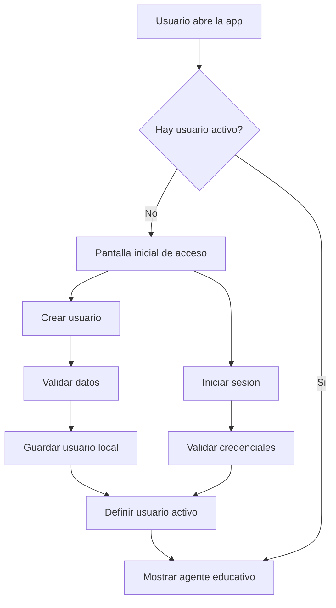

# HU-007 - Multiusuario y multiples chats con registro local

## 1. Resumen de la version

En la version 07 se propone evolucionar el asistente educativo para soportar usuarios locales y multiples conversaciones por usuario.

Antes de ingresar al agente, el usuario debera poder:

- Iniciar sesion con un usuario existente.
- Crear un nuevo usuario desde una pantalla inicial.

Para esta version se usara la opcion A: una pantalla inicial de acceso dentro de Streamlit. No se implementara una ventana emergente ni una redireccion real entre paginas.

## 2. Objetivo funcional

Como estudiante que usa el asistente educativo, necesito crear un usuario local e iniciar sesion para que mis conversaciones queden separadas de las de otros usuarios y pueda organizar varios chats de aprendizaje.

El objetivo de esta version es que el sistema:

- Permita crear usuarios locales.
- Permita iniciar sesion con un usuario creado.
- Mantenga un usuario activo durante la sesion de Streamlit.
- Muestre el usuario activo en la parte superior derecha de la interfaz.
- Permita preparar la arquitectura para multiples chats por usuario.
- Mantenga la memoria persistente implementada en HU-06.
- Mantenga el limite de 20 mensajes por conversacion.

## 3. Credenciales del usuario

Para esta version, cada usuario se creara con:

| Campo | Descripcion |
| --- | --- |
| `name` | Nombre visible del estudiante. |
| `username` | Nombre de usuario unico para iniciar sesion. |
| `password` | Contrasena local del usuario. |

Decision de esta version:

```text
La contrasena se guardara como password y no como password_hash.
```

Esta decision se acepta porque el proyecto se encuentra en una version academica inicial. En una version futura se debera reemplazar por almacenamiento seguro con hash.

## 4. Flujo propuesto de acceso



## 5. Pantalla inicial propuesta

Cuando no exista un usuario activo, la aplicacion no debera mostrar directamente el chat principal.

En su lugar, debera mostrar una pantalla inicial con dos opciones:

```text
Iniciar sesion
Crear usuario
```

### 5.1 Crear usuario

El formulario de creacion debera solicitar:

- Nombre.
- Nombre de usuario.
- Contrasena.
- Confirmacion de contrasena.

Validaciones minimas:

- El nombre no debe estar vacio.
- El nombre de usuario no debe estar vacio.
- El nombre de usuario debe ser unico.
- La contrasena no debe estar vacia.
- La confirmacion debe coincidir con la contrasena.

Despues de crear el usuario correctamente:

1. Se guarda el usuario localmente.
2. Se define como usuario activo.
3. Se muestra el agente educativo.
4. El usuario aparece en la parte superior derecha.

### 5.2 Iniciar sesion

El formulario de inicio de sesion debera solicitar:

- Nombre de usuario.
- Contrasena.

Validaciones minimas:

- El usuario debe existir.
- La contrasena debe coincidir con la almacenada.

Despues de iniciar sesion correctamente:

1. Se define el usuario activo.
2. Se cargan sus chats disponibles.
3. Se muestra el agente educativo.

## 6. Usuario activo en la interfaz

Cuando exista un usuario activo, la interfaz debera mostrar en la parte superior derecha:

```text
Nombre (@username)
```

Ejemplo:

```text
Leonardo (@leo123)
```

Tambien se debera incluir una opcion para cerrar sesion.

Cerrar sesion debera:

- Quitar el usuario activo de `st.session_state`.
- Quitar el chat activo.
- Limpiar el historial visible.
- Volver a la pantalla inicial de acceso.

Cerrar sesion no debe eliminar usuarios ni conversaciones guardadas.

## 7. Multiples chats por usuario

La HU-07 tambien prepara el sistema para multiples conversaciones por usuario.

Cada usuario podra tener varios chats:

```text
Usuario Leonardo
|-- Chat 1: Variables en Python
|-- Chat 2: Ciclos for
`-- Chat 3: Proyecto Streamlit
```

Cada chat debera tener:

| Campo | Descripcion |
| --- | --- |
| `chat_id` | Identificador unico del chat. |
| `user_id` | Usuario propietario del chat. |
| `title` | Titulo visible del chat. |
| `created_at` | Fecha de creacion. |
| `updated_at` | Fecha de ultima actualizacion. |
| `message_count` | Cantidad de mensajes del chat. |

## 8. Relacion con la memoria de HU-06

La HU-06 guarda historial por `session_id`.

En HU-07, el `session_id` debera construirse a partir del usuario y del chat activo.

Ejemplo:

```text
session_id = user_{username}_chat_{chat_id}
```

Esto permite separar la memoria por usuario y por conversacion.

Antes:

```text
session_id -> historial
```

Despues:

```text
user_id + chat_id -> session_id -> historial
```

## 9. Arquitectura propuesta

Se propone mantener la arquitectura actual y agregar servicios especializados.

```text
app.py
|
v
UI/asistente.py
|
v
Graphs/learning_graph.py
|
v
Services/conversation_memory.py
Services/user_manager.py
Services/chat_manager.py
|
v
SQLite
```

Responsabilidades sugeridas:

| Componente | Responsabilidad |
| --- | --- |
| `Services/user_manager.py` | Crear usuarios, validar credenciales y recuperar usuarios. |
| `Services/chat_manager.py` | Crear, listar, seleccionar y eliminar chats por usuario. |
| `Services/conversation_memory.py` | Mantener mensajes persistentes por `session_id` con limite de 20 mensajes. |
| `app.py` | Mostrar pantalla inicial, usuario activo, sidebar de chats y chat principal. |

## 10. Flujo de uso esperado

1. El usuario abre la aplicacion.
2. Si no hay usuario activo, se muestra la pantalla inicial.
3. El usuario crea una cuenta o inicia sesion.
4. El sistema define el usuario activo.
5. La interfaz muestra el usuario en la parte superior derecha.
6. El usuario crea o selecciona un chat.
7. El sistema construye el `session_id` usando usuario y chat.
8. El asistente responde usando el flujo actual de LangGraph.
9. La memoria se guarda en SQLite con limite de 20 mensajes por chat.

## 11. Cambios esperados

### 11.1 Registro local

Se debera implementar una forma local de guardar usuarios.

Campos esperados:

```text
name
username
password
created_at
```

### 11.2 Inicio de sesion

Se debera validar:

```text
username + password
```

Si las credenciales son correctas, el usuario queda activo.

### 11.3 Chats por usuario

Se debera permitir:

- Crear nuevo chat.
- Listar chats del usuario activo.
- Seleccionar un chat existente.
- Eliminar un chat.

### 11.4 Integracion con memoria

Cada chat debera usar un `session_id` propio.

La memoria persistente de HU-06 no se elimina, sino que se reutiliza.

## 12. Fuera de alcance

No se implementara en esta version:

- Hash de contrasenas.
- Recuperacion de contrasena.
- Login con correo electronico.
- OAuth.
- JWT.
- Roles y permisos.
- Autenticacion segura de produccion.
- Cookies persistentes.
- Memoria vectorial.
- ChromaDB.
- Embeddings.
- Generacion de titulos con LLM.
- Panel avanzado de memorias.

## 13. Criterios de aceptacion

| Criterio | Resultado esperado |
| --- | --- |
| La app inicia sin usuario activo. | Se muestra pantalla de acceso, no el chat principal. |
| El usuario puede crear una cuenta local. | Se guarda `name`, `username` y `password`. |
| No se permiten usernames duplicados. | El sistema muestra un error claro. |
| El usuario puede iniciar sesion. | El sistema valida `username` y `password`. |
| El usuario activo se muestra en la interfaz. | Se ve `Nombre (@username)` en la parte superior derecha. |
| El usuario puede cerrar sesion. | La app vuelve a la pantalla inicial. |
| El usuario puede crear chats. | Cada chat queda asociado al usuario activo. |
| El usuario puede seleccionar chats anteriores. | Se carga el historial del chat seleccionado. |
| La memoria se separa por usuario y chat. | Un chat no mezcla mensajes con otro chat. |
| Se mantiene el limite de 20 mensajes. | Cada chat conserva maximo 20 mensajes en memoria. |


## 14. Pendientes posteriores

- Cambiar `password` por `password_hash`.
- Evaluar recuperacion de contrasena.
- Agregar memoria vectorial por usuario.
- Agregar titulos automaticos de chats con LLM.
- Mejorar la UI con modal o navegacion simulada.
- Agregar pruebas automatizadas para usuarios y chats.
