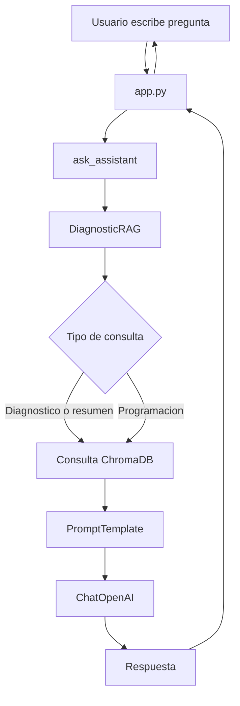

# HU-002 - Asistente educativo de programacion con RAG diagnostico

## 1. Resumen de la historia de usuario

Se implemento una funcionalidad para que un estudiante pueda interactuar con un asistente educativo de programacion desde una interfaz web. El asistente responde preguntas generales, adapta su estilo de respuesta segun el tono y modo de aprendizaje seleccionados, y puede usar un diagnostico educativo en PDF como fuente de contexto cuando la pregunta esta relacionada con los resultados del grupo.

## 2. Objetivo funcional

Permitir que el usuario reciba apoyo personalizado para aprender programacion mediante:

- Un chat educativo.
- Seleccion de tono del asistente.
- Seleccion de modo de aprendizaje.
- Respuestas contextualizadas con un diagnostico estudiantil.
- Recuperacion de informacion desde un PDF usando RAG.

## 3. Lo que se realizo

### Interfaz de usuario

Se creo una aplicacion en Streamlit desde `app.py` que incluye:

- Configuracion de pagina.
- Titulo y descripcion del asistente.
- Sidebar con informacion del sistema.
- Estado del PDF diagnostico.
- Estado de la base vectorial.
- Boton para procesar o reconstruir el diagnostico.
- Selector de tono del asistente.
- Selector de modo de aprendizaje.
- Boton para limpiar el chat.
- Seccion principal de chat.
- Lista de temas sugeridos.

### Gestion del estado conversacional

Se usa `st.session_state` para mantener:

- Historial de mensajes.
- Tono seleccionado.
- Modo de aprendizaje seleccionado.

### Servicio conversacional

Se implemento `UI/asistente.py` como capa encargada de:

- Inicializar el modelo `ChatOpenAI`.
- Crear el `PromptTemplate`.
- Construir la cadena LCEL.
- Inicializar `DiagnosticRAG`.
- Validar que la base vectorial tenga documentos.
- Procesar preguntas del usuario.
- Devolver respuesta y fuentes recuperadas.
- Manejar errores comunes.

La cadena principal usa:

```python
prompt_template | llm | StrOutputParser()
```

### Prompt pedagogico

Se definio `PROGRAMMING_TEMPLATE` en `Prompts/prompt.py`.

El prompt permite controlar:

- Tono del asistente.
- Modo de aprendizaje.
- Tipo de consulta.
- Contexto diagnostico.
- Pregunta del usuario.

Tambien define reglas diferenciadas para consultas sobre diagnostico, preguntas generales de programacion y modos pedagogicos.

### Procesamiento del documento diagnostico

Se implemento `Services/setup_diagnostic_rag.py` para construir la base vectorial.

El flujo realizado es:

1. Validar que exista el PDF.
2. Cargar el documento con `PyPDFLoader`.
3. Agregar metadata por pagina.
4. Dividir el contenido con `RecursiveCharacterTextSplitter`.
5. Agregar metadata por fragmento.
6. Eliminar una base vectorial anterior si existe.
7. Crear una nueva coleccion en ChromaDB.
8. Persistir los embeddings localmente.

### Recuperacion RAG

Se implemento `Services/diagnostic_rag.py` para consultar la base vectorial.

Incluye:

- Normalizacion de texto para comparar sin tildes.
- Deteccion de preguntas relacionadas con diagnostico.
- Deteccion de solicitudes de resumen.
- Construccion de consultas enriquecidas.
- Recuperacion por similitud semantica.
- Formato del contexto para el prompt.
- Construccion de fuentes sin duplicados.

### Configuracion centralizada

Se creo `Models/config.py` para centralizar:

- Ruta del PDF.
- Ruta de ChromaDB.
- Nombre de coleccion.
- Modelo de chat.
- Modelo de embeddings.
- Temperatura.
- Cantidad de fragmentos recuperados.

## 4. Flujo implementado para el usuario



## 5. Criterios de aceptacion cubiertos

| Criterio | Estado |
| --- | --- |
| El usuario puede escribir preguntas en un chat. | Cumplido |
| El asistente responde usando un LLM. | Cumplido |
| El usuario puede seleccionar el tono de respuesta. | Cumplido |
| El usuario puede seleccionar el modo de aprendizaje. | Cumplido |
| El sistema puede procesar un PDF diagnostico. | Cumplido |
| El sistema crea una base vectorial local. | Cumplido |
| El asistente recupera contexto desde ChromaDB. | Cumplido |
| Las consultas de diagnostico usan contexto del PDF. | Cumplido |
| Las consultas generales de programacion ignoran el diagnostico. | Cumplido mediante instrucciones del prompt |
| Se muestran errores legibles cuando falta la base vectorial. | Cumplido parcialmente |

## 6. Pendientes tecnicos identificados

- `Models/config.py` calcula rutas desde la carpeta `Models`, pero las carpetas `docs/` y `chroma_diagnostico/` estan en la raiz del proyecto.
- `DiagnosticRAG.get_all_documents()` retorna dentro del ciclo, por lo que los resumenes pueden usar solo el primer fragmento.
- Hay textos con problemas de codificacion en la interfaz y prompts.
- `Services/ejemplo_Asistente_IA.py` parece ser codigo legado y no coincide con las variables actuales del prompt.


## 7. Resultado final de la HU

La HU deja implementado un asistente educativo funcional con Streamlit, LangChain, OpenAI y ChromaDB. El usuario puede conversar con el asistente, personalizar el estilo de respuesta y obtener respuestas apoyadas en un diagnostico educativo previamente vectorizado.

