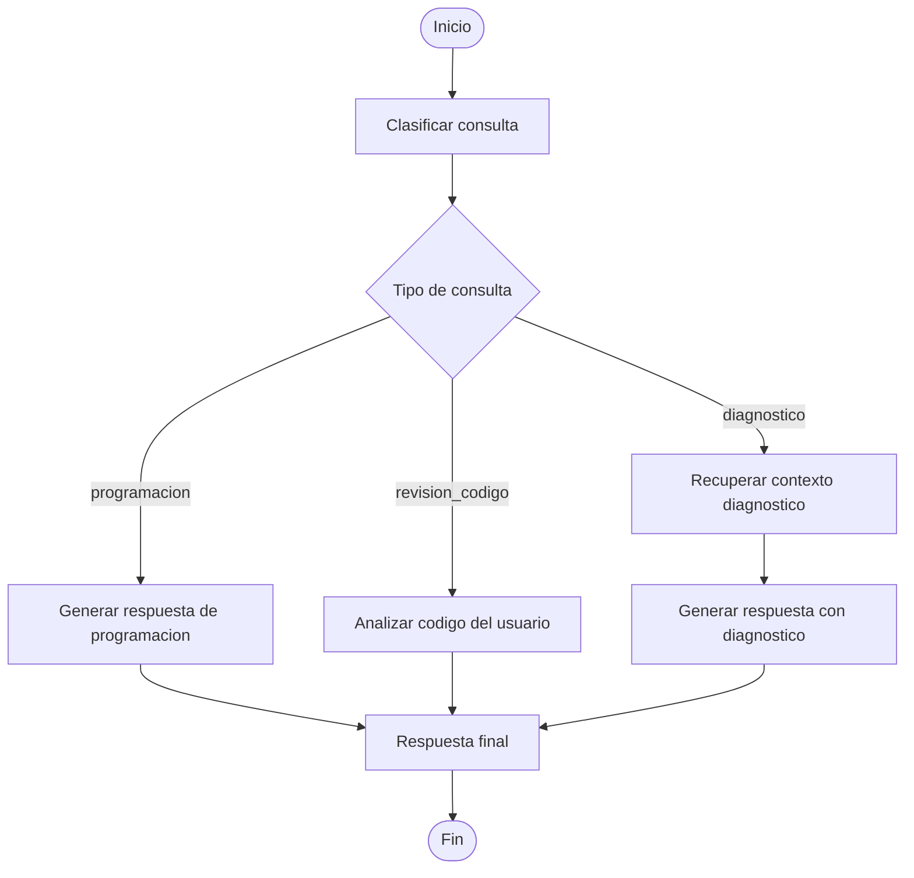

# HU-003 - Integracion de LangGraph en el asistente educativo

## 1. Descripcion

Esta historia de usuario propone evolucionar el proyecto `IA-Lanchaing` desde un flujo lineal basado en Streamlit, LangChain y RAG hacia una arquitectura orquestada con LangGraph.

Actualmente, el asistente educativo permite responder preguntas de programacion y consultar informacion de un diagnostico educativo mediante RAG. La siguiente mejora consiste en incorporar un grafo de ejecucion que permita separar responsabilidades en nodos, clasificar mejor las consultas del usuario y controlar el flujo de respuesta de forma mas escalable.

La implementacion tomara como referencia el avance realizado en el proyecto `helpdesk_system`, especialmente el uso de LangGraph, estados compartidos, nodos especializados y rutas condicionales.

## 2. Objetivo de la HU

Permitir que el asistente educativo use LangGraph para gestionar el flujo de una consulta, diferenciando entre preguntas generales de programacion, consultas sobre el diagnostico educativo y posibles revisiones de codigo.

El objetivo principal es mejorar la arquitectura interna del asistente sin cambiar drasticamente la experiencia visual del usuario en Streamlit.

## 3. Alcance funcional

La HU contempla:

- Crear un estado principal para el asistente educativo.
- Definir un grafo con nodos especializados.
- Clasificar el tipo de consulta realizada por el usuario.
- Recuperar contexto diagnostico solo cuando sea necesario.
- Generar respuestas diferenciadas segun el tipo de consulta.
- Mantener compatibilidad con el tono y modo de aprendizaje seleccionados en la interfaz.
- Preparar la base para futuras mejoras como revision de codigo, memoria conversacional o evaluacion de respuestas.

## 4. Flujo propuesto



## 5. Nodos propuestos

| Nodo | Responsabilidad |
| --- | --- |
| `clasificar_consulta` | Identificar si la pregunta corresponde a diagnostico, programacion general o revision de codigo. |
| `recuperar_diagnostico` | Consultar ChromaDB y obtener contexto relevante del PDF diagnostico. |
| `generar_respuesta_programacion` | Generar una respuesta educativa sin usar el contexto diagnostico. |
| `generar_respuesta_diagnostico` | Generar una respuesta basada en el contexto recuperado del diagnostico. |
| `analizar_codigo` | Preparar la futura revision de fragmentos de codigo enviados por el usuario. |
| `respuesta_final` | Consolidar la respuesta que sera devuelta a Streamlit. |

## 6. Estado propuesto

El grafo deberia manejar un estado similar al siguiente:

```python
class LearningAssistantState(TypedDict):
    question: str
    tono: str
    modo_aprendizaje: str
    tipo_consulta: str
    contexto_diagnostico: Optional[str]
    fuentes: list[dict]
    respuesta: Optional[str]
    requiere_revision_codigo: bool
    historial: list[str]
```

## 7. Criterios de aceptacion

| Criterio | Resultado esperado |
| --- | --- |
| El sistema recibe una pregunta desde Streamlit. | La pregunta se envia al grafo de LangGraph. |
| El grafo clasifica la consulta. | Se identifica si es diagnostico, programacion o revision de codigo. |
| Una consulta de diagnostico recupera contexto. | Se consulta ChromaDB y se adjuntan fuentes. |
| Una consulta de programacion no usa el diagnostico. | La respuesta se genera sin mencionar PDF, encuesta ni resultados del grupo. |
| El tono seleccionado se conserva. | La respuesta respeta el tono elegido por el usuario. |
| El modo de aprendizaje se conserva. | La respuesta sigue la estrategia pedagogica seleccionada. |
| La interfaz no cambia drasticamente. | `app.py` mantiene la experiencia actual del usuario. |
| El flujo queda documentado. | La HU, arquitectura y documentacion tecnica reflejan el nuevo grafo. |

## 8. Fuera de alcance para esta HU

No se implementara en esta fase:

- Sistema de tickets.
- Escalado a humano.
- Checkpointing con SQLite.
- MultiQueryRetriever.
- Memoria conversacional persistente.
- Panel administrativo.
- Cambios visuales grandes en Streamlit.

Estos elementos podrian considerarse en historias de usuario futuras.

## 9. Beneficios esperados

- Mejor separacion de responsabilidades.
- Flujo mas facil de probar y mantener.
- Base mas escalable para nuevas funcionalidades.
- Mejor alineacion con arquitecturas modernas basadas en LangGraph.
- Mayor claridad para documentar y explicar el proyecto.

## 10. Riesgos y consideraciones

| Riesgo | Consideracion |
| --- | --- |
| Aumentar complejidad innecesaria | Implementar primero un grafo pequeno y funcional. |
| Romper el flujo actual de Streamlit | Mantener `app.py` casi igual y encapsular LangGraph en una capa nueva. |
| Mezclar clasificacion con recuperacion | Separar cada responsabilidad en nodos independientes. |
| Duplicar logica existente | Reutilizar `DiagnosticRAG` y el prompt actual cuando sea posible. |
| Falta de pruebas | Agregar pruebas minimas despues de estabilizar el grafo. |

## 11. Resultado esperado

Al finalizar esta HU, el proyecto `IA-Lanchaing` tendra un primer flujo con LangGraph capaz de orquestar las consultas del asistente educativo.

El usuario seguira interactuando desde Streamlit, pero internamente la respuesta sera procesada mediante un grafo con nodos especializados, permitiendo una evolucion mas ordenada del proyecto.
