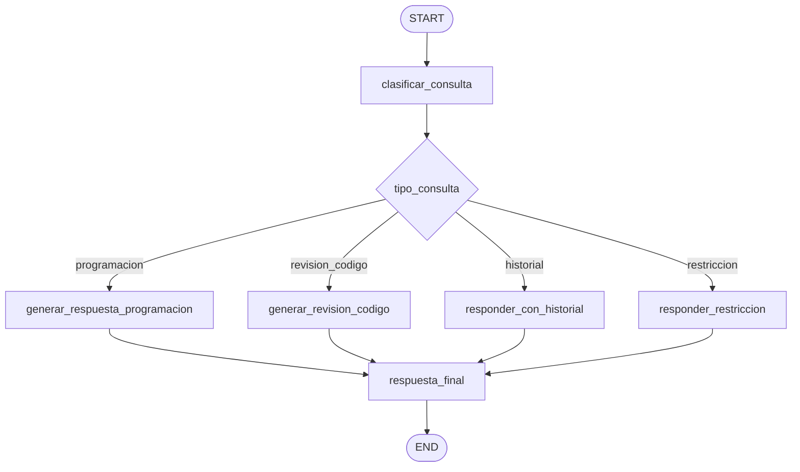

# IA-Lanchaing

<<<<<<< HEAD
Asistente educativo de programacion construido con Python, Streamlit, LangChain, LangGraph, OpenAI y ChromaDB.

La version actual corresponde a la **V04**. En esta version el asistente se enfoca en aprendizaje guiado: orienta al estudiante paso a paso, explica el razonamiento, ofrece pistas progresivas y evita entregar la respuesta completa de inmediato. La interfaz tambien fue simplificada para usar un tono fijo normal, claro y amigable, un modo fijo de aprendizaje guiado y una paleta visual definida.
=======
Asistente educativo de programacion construido con Python, Streamlit, LangChain, LangGraph y OpenAI.

La version actual implementa un tutor guiado para aprender programacion. El sistema clasifica cada consulta con un LLM, enruta la conversacion mediante LangGraph y conserva memoria temporal por sesion para responder preguntas relacionadas con el historial.
>>>>>>> HU-005-fase-5-QA

## Tabla de contenido

- [Descripcion del proyecto](#descripcion-del-proyecto)
- [Objetivo](#objetivo)
- [Funcionalidades principales](#funcionalidades-principales)
- [Cambios de la version 04](#cambios-de-la-version-04)
- [Arquitectura general](#arquitectura-general)
- [Flujo con LangGraph](#flujo-con-langgraph)
- [Estructura del proyecto](#estructura-del-proyecto)
- [Documentacion del proyecto](#documentacion-del-proyecto)
- [Tecnologias utilizadas](#tecnologias-utilizadas)
- [Ejecucion del proyecto](#ejecucion-del-proyecto)
- [Estado actual](#estado-actual)
- [Mejoras recomendadas](#mejoras-recomendadas)

## Descripcion del proyecto

<<<<<<< HEAD
`IA-Lanchaing` es una aplicacion academica orientada al aprendizaje de programacion. Su interfaz principal esta desarrollada en Streamlit y ofrece una experiencia de chat donde el usuario puede realizar preguntas, pedir orientacion sobre ejercicios, solicitar revision de codigo o consultar informacion relacionada con un diagnostico educativo.
=======
`IA-Lanchaing` es una aplicacion academica orientada al aprendizaje de programacion. La interfaz principal esta desarrollada en Streamlit y permite que el usuario realice preguntas, comparta dudas, pegue fragmentos de codigo o consulte informacion previamente mencionada dentro de la misma sesion.
>>>>>>> HU-005-fase-5-QA

El asistente trabaja con cuatro tipos de consulta:

<<<<<<< HEAD
- **Tutoria guiada de programacion:** responde con pasos, preguntas y pistas para que el estudiante construya la solucion.
- **Consulta contextual con RAG:** recupera informacion desde un PDF diagnostico previamente procesado e indexado en ChromaDB.
- **Orquestacion con LangGraph:** dirige cada consulta por un flujo de nodos segun el tipo de pregunta.

## Objetivo

El objetivo del proyecto es brindar un tutor inteligente que apoye el proceso de aprendizaje de programacion de forma clara, guiada y contextualizada.

El sistema busca:

- Ayudar al estudiante a comprender conceptos de programacion.
- Guiar el proceso de pensamiento en lugar de entregar respuestas completas inmediatamente.
- Mantener un tono normal, claro y amigable.
- Usar aprendizaje guiado como estrategia pedagogica unica.
- Usar un diagnostico educativo como fuente de contexto cuando la pregunta lo requiera.
- Separar responsabilidades internas mediante un grafo de LangGraph.
- Mantener una base modular para evolucionar hacia una arquitectura mas robusta.

## Funcionalidades principales

- Chat educativo mediante Streamlit.
- Tono fijo: `Normal, claro y amigable`.
- Modo fijo: `Aprendizaje guiado`.
- Prompt pedagogico que desglosa problemas paso a paso.
- Reglas para no entregar soluciones completas de inmediato.
- Procesamiento de un PDF diagnostico.
- Creacion de una base vectorial local con ChromaDB.
- Recuperacion de contexto mediante embeddings de OpenAI.
- Generacion de respuestas con `ChatOpenAI`.
- Orquestacion del flujo mediante LangGraph.
- Clasificacion de consultas: diagnostico, programacion y revision de codigo.
- Historial de conversacion en `st.session_state`.
- Boton para reconstruir el diagnostico desde la interfaz.
- Tema visual uniforme basado en azul, celeste y menta: `#95D1DC`, `#E7F0EA`, `#1A77A3`, `#155F82` y `#F7FBFA`.
- Archivo de dependencias en `Requirements/requirements.txt`.

## Cambios de la version 04

La V04 consolida el enfoque pedagogico del asistente:

| Cambio | Decision |
| --- | --- |
| Selector de tono eliminado | El asistente usa un tono fijo para reducir configuracion y mantener consistencia. |
| Selector de modo eliminado | El sistema funciona siempre como tutor de aprendizaje guiado. |
| Prompt reforzado | El modelo debe presentar pasos, explicar razonamiento y detenerse para que el estudiante intente avanzar. |
| Soluciones completas restringidas | El asistente no debe revelar la conclusion o codigo final de inmediato. |
| Paleta visual agregada | La UI adopta colores definidos por el usuario para dar identidad visual. |
| Dependencias documentadas | Se agrego `Requirements/requirements.txt` para facilitar instalacion. |
=======
| Tipo | Uso |
| --- | --- |
| `programacion` | Preguntas conceptuales o practicas sobre programacion. |
| `revision_codigo` | Analisis de codigo, errores, trazas, bugs o debugging. |
| `historial` | Preguntas que dependen de recordar informacion conversacional previa. |
| `restriccion` | Consultas fuera del dominio de programacion. |

## Objetivo

Brindar un tutor inteligente que apoye el aprendizaje de programacion con respuestas claras, guiadas y enfocadas en que el estudiante razone paso a paso.

El sistema busca:

- Guiar al estudiante sin entregar soluciones completas de inmediato.
- Separar responsabilidades entre interfaz, adaptador, grafo, prompt y configuracion.
- Clasificar consultas con un LLM para evitar reglas rigidas por palabras clave.
- Mantener memoria temporal por sesion usando `RunnableWithMessageHistory`.
- Restringir preguntas que no esten relacionadas con programacion o historial del aprendizaje.

## Funcionalidades principales

- Chat educativo con Streamlit.
- Tono fijo: `Normal, claro y amigable`.
- Modo fijo: `Aprendizaje guiado`.
- Clasificacion LLM en cuatro categorias.
- Orquestacion del flujo mediante LangGraph.
- Memoria conversacional temporal por `session_id`.
- Respuestas guiadas mediante `ChatOpenAI`.
- Prompt pedagogico con reglas por tipo de consulta.
- Boton para limpiar chat y reiniciar la memoria de la sesion.
- Tema visual uniforme basado en azul, celeste y menta.
>>>>>>> HU-005-fase-5-QA

## Arquitectura general

El proyecto sigue un monolito modular. La aplicacion se ejecuta desde `app.py`, pero la logica se divide por responsabilidades:

<<<<<<< HEAD
- `UI/`: capa de entrada del asistente para Streamlit.
- `Graphs/`: flujos de LangGraph y estado del asistente.
- `Services/`: servicios de procesamiento documental y recuperacion RAG.
- `Models/`: configuracion central del proyecto.
- `Prompts/`: plantilla principal enviada al modelo.
- `docs/`: documento PDF usado como fuente de conocimiento.
- `chroma_diagnostico/`: base vectorial persistente.
- `Requirements/`: dependencias instalables.
=======
- `app.py`: interfaz Streamlit, estado visual del chat y constantes pedagogicas.
- `UI/`: adaptador entre Streamlit y el grafo.
- `Graphs/`: orquestacion con LangGraph, clasificacion y memoria.
- `Models/`: configuracion central del modelo.
- `Prompts/`: plantilla del comportamiento pedagogico.
- `Requirements/`: dependencias del proyecto.
>>>>>>> HU-005-fase-5-QA
- `Documentacion/`: documentacion tecnica y arquitectura.
- `HU-docs/`: historias de usuario del proyecto.

```mermaid
flowchart TD
    U[Usuario] --> APP[app.py Streamlit]
    APP --> CONST[Tono fijo y aprendizaje guiado fijo]
    CONST --> UI[UI/asistente.py]
    UI --> G[Graphs/learning_graph.py]
<<<<<<< HEAD
    G --> C{Tipo de consulta}
    C -->|diagnostico| RAG[Services/diagnostic_rag.py]
    C -->|programacion| LLM[ChatOpenAI con guia paso a paso]
    C -->|revision_codigo| CODE[Revision guiada]
    RAG --> LLM
    CODE --> LLM
    LLM --> UI
    UI --> APP
=======
    G --> C{Clasificacion LLM}
    C -->|programacion| P[Respuesta guiada]
    C -->|revision_codigo| R[Revision de codigo]
    C -->|historial| H[Memoria conversacional]
    C -->|restriccion| X[Respuesta de restriccion]
    P --> M[RunnableWithMessageHistory]
    R --> M
    H --> M
    X --> M
    M --> OAI[ChatOpenAI]
    OAI --> APP
>>>>>>> HU-005-fase-5-QA
    APP --> U
```

## Flujo con LangGraph

El grafo principal se encuentra en `Graphs/learning_graph.py`.

| Nodo | Responsabilidad |
| --- | --- |
<<<<<<< HEAD
| `clasificar_consulta` | Identifica si la pregunta es de diagnostico, programacion o revision de codigo. |
| `recuperar_diagnostico` | Consulta ChromaDB y obtiene contexto del PDF cuando aplica. |
| `generar_respuesta_programacion` | Genera respuestas generales de programacion sin usar contexto diagnostico. |
| `generar_respuesta_diagnostico` | Genera respuestas usando el contexto recuperado del diagnostico. |
| `analizar_codigo` | Procesa consultas de revision de codigo bajo reglas de aprendizaje guiado. |
| `respuesta_final` | Prepara la respuesta final que se devuelve a Streamlit. |
=======
| `clasificar_consulta` | Clasifica la consulta con un LLM. |
| `generar_respuesta_programacion` | Responde preguntas generales de programacion. |
| `generar_revision_codigo` | Guia la revision de codigo o errores. |
| `responder_con_historial` | Responde usando memoria conversacional disponible. |
| `responder_restriccion` | Rechaza amablemente preguntas fuera de dominio. |
| `respuesta_final` | Cierra el flujo y devuelve la respuesta a Streamlit. |
>>>>>>> HU-005-fase-5-QA



## Estructura del proyecto

```text
IA-Lanchaing/
|-- app.py
|-- README.md
|-- Documentacion/
|   |-- ARQUITECTURA_PROYECTO.md
|   `-- DOCUMENTACION_CODIGO.md
|-- Graphs/
|   |-- __init__.py
|   `-- learning_graph.py
|-- HU-docs/
|   |-- HU-001 - Asistente educativo de programacion con seleccion de tono.md
<<<<<<< HEAD
|   |-- HU_Asistente_Educativo_RAG.md
|   |-- HU_Integracion_LangGraph_Asistente_Educativo.md
|   `-- HU_04.md
=======
|   |-- HU_04.md
|   `-- HU_05.md
>>>>>>> HU-005-fase-5-QA
|-- Models/
|   `-- config.py
|-- Prompts/
|   `-- prompt.py
|-- Requirements/
|   `-- requirements.txt
|-- Services/
|   `-- ejemplo_Asistente_IA.py
`-- UI/
    `-- asistente.py
```

## Documentacion del proyecto

| Documento | Descripcion |
| --- | --- |
<<<<<<< HEAD
| [Documentacion del codigo](./Documentacion/DOCUMENTACION_CODIGO.md) | Explica modulos, funciones, flujo de datos, comandos utiles y hallazgos tecnicos. |
| [Arquitectura del proyecto](./Documentacion/ARQUITECTURA_PROYECTO.md) | Describe componentes, diagramas, integraciones, riesgos y decisiones actuales. |
| [HU-01 - Asistente educativo con seleccion de tono](./HU-docs/HU-001%20-%20Asistente%20educativo%20de%20programaci%C3%B3n%20con%20selecci%C3%B3n%20de%20tono.md) | Describe una fase anterior con seleccion de tono. |
| [HU-02 - Asistente educativo con RAG](./HU-docs/HU_Asistente_Educativo_RAG.md) | Resume la incorporacion del RAG diagnostico. |
| [HU-03 - Integracion de LangGraph](./HU-docs/HU_Integracion_LangGraph_Asistente_Educativo.md) | Describe la incorporacion del grafo de LangGraph. |
| [HU-04 - Aprendizaje guiado y paleta visual](./HU-docs/HU_04.md) | Documenta la version actual: aprendizaje guiado fijo, tono fijo, prompt reforzado, paleta visual y dependencias. |
=======
| [Documentacion del codigo](./Documentacion/DOCUMENTACION_CODIGO.md) | Explica modulos, funciones y flujo tecnico actual. |
| [Arquitectura del proyecto](./Documentacion/ARQUITECTURA_PROYECTO.md) | Describe componentes, diagramas, decisiones y riesgos. |
| [HU-05 - Clasificacion LLM y memoria conversacional](./HU-docs/HU_05.md) | Historia de usuario de la version actual. |
| [HU-04 - Aprendizaje guiado y paleta visual](./HU-docs/HU_04.md) | Historia de usuario de la fase anterior. |
| [HU-01 - Asistente educativo con seleccion de tono](./HU-docs/HU-001%20-%20Asistente%20educativo%20de%20programaci%C3%B3n%20con%20selecci%C3%B3n%20de%20tono.md) | Historia de usuario inicial. |
>>>>>>> HU-005-fase-5-QA

## Tecnologias utilizadas

| Tecnologia | Uso |
| --- | --- |
| Python | Lenguaje principal. |
| Streamlit | Interfaz web y chat. |
| LangChain | Construccion de cadenas, prompts y memoria. |
| LangGraph | Orquestacion del flujo por nodos. |
| LCEL | Composicion `Prompt | ChatOpenAI | StrOutputParser`. |
| OpenAI | Modelo conversacional. |

Modelo configurado:

| Modelo | Proposito |
| --- | --- |
| `gpt-4o-mini` | Clasificacion y generacion de respuestas. |

## Ejecucion del proyecto

Instalar dependencias:
<<<<<<< HEAD

```bash
pip install -r Requirements/requirements.txt
```

Desde la raiz del proyecto, reconstruir el diagnostico:
=======
>>>>>>> HU-005-fase-5-QA

```bash
pip install -r Requirements/requirements.txt
```

Ejecutar la aplicacion:

```bash
streamlit run app.py
```

## Estado actual

<<<<<<< HEAD
El proyecto se encuentra en estado de prototipo funcional avanzado. Ya cuenta con interfaz de usuario, integracion con un LLM, procesamiento de PDF, base vectorial local, recuperacion de contexto mediante RAG, flujo de LangGraph y un comportamiento pedagogico guiado definido como experiencia principal.

## Mejoras recomendadas

- Mostrar las fuentes diagnosticas recuperadas dentro del chat.
- Reemplazar imports wildcard en `app.py` por imports explicitos.
- Agregar pruebas automatizadas con `pytest`.
- Validar que ChromaDB no solo exista, sino que contenga documentos desde el sidebar.
- Agregar manejo especifico de errores de OpenAI.
- Incorporar medicion de latencia, tokens y costos.
- Evaluar memoria conversacional persistente en una HU futura.
- Revisar o retirar el modulo legado `Services/ejemplo_Asistente_IA.py`.
=======
Implementado:

- Clasificacion LLM con cuatro categorias.
- Eliminacion del flujo de diagnostico, PDF, embeddings y ChromaDB.
- Memoria temporal por sesion.
- Restriccion amable de consultas fuera de programacion.
- Documentacion tecnica actualizada.

## Mejoras recomendadas

- Agregar pruebas unitarias para la normalizacion de categorias.
- Agregar pruebas del enrutamiento de LangGraph.
- Persistir memoria en una base de datos cuando se estudie manejo de sesiones.
- Agregar streaming de tokens en Streamlit.
- Separar el CSS de `app.py` si la interfaz sigue creciendo.
>>>>>>> HU-005-fase-5-QA
