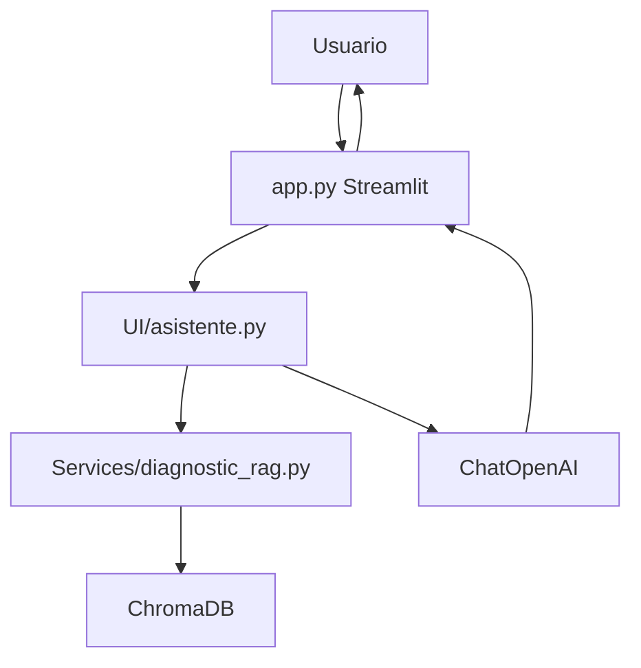

# IA-Lanchaing

Asistente educativo de programacion construido con Python, Streamlit, LangChain, OpenAI y ChromaDB. El proyecto permite que un estudiante interactue con un tutor inteligente capaz de responder preguntas de programacion y adaptar sus explicaciones segun el tono y modo de aprendizaje seleccionados.

Ademas, el sistema incorpora un flujo RAG sobre un documento diagnostico en PDF. Esto permite que, cuando el usuario haga preguntas relacionadas con la encuesta, el reporte o las dificultades del grupo, el asistente recupere informacion relevante desde una base vectorial local y genere respuestas contextualizadas.

## Tabla de contenido

- [Descripcion del proyecto](#descripcion-del-proyecto)
- [Objetivo](#objetivo)
- [Funcionalidades principales](#funcionalidades-principales)
- [Arquitectura general](#arquitectura-general)
- [Estructura del proyecto](#estructura-del-proyecto)
- [Documentacion del proyecto](#documentacion-del-proyecto)
- [Tecnologias utilizadas](#tecnologias-utilizadas)
- [Ejecucion del proyecto](#ejecucion-del-proyecto)
- [Estado actual](#estado-actual)
- [Mejoras recomendadas](#mejoras-recomendadas)

## Descripcion del proyecto

`IA-Lanchaing` es una aplicacion academica orientada al aprendizaje de programacion. Su interfaz principal esta desarrollada en Streamlit y ofrece una experiencia de chat donde el usuario puede realizar preguntas, solicitar explicaciones, pedir revision de codigo o consultar informacion relacionada con un diagnostico educativo.

El asistente combina dos capacidades:

- **Asistencia general de programacion:** responde preguntas sobre conceptos, errores, estructuras de control, listas, variables, ciclos y ejercicios.
- **Consulta contextual con RAG:** recupera informacion desde un PDF diagnostico previamente procesado e indexado en ChromaDB.

## Objetivo

El objetivo del proyecto es brindar un tutor inteligente que apoye el proceso de aprendizaje de programacion de forma personalizada, clara y contextualizada.

El sistema busca:

- Ayudar al estudiante a comprender conceptos de programacion.
- Adaptar el estilo de respuesta al tono elegido.
- Ajustar la explicacion al modo de aprendizaje seleccionado.
- Usar un diagnostico educativo como fuente de contexto cuando la pregunta lo requiera.
- Mantener una base modular para evolucionar hacia una arquitectura mas robusta.

## Funcionalidades principales

- Chat educativo mediante Streamlit.
- Selector de tono del asistente.
- Selector de modo de aprendizaje.
- Procesamiento de un PDF diagnostico.
- Creacion de una base vectorial local con ChromaDB.
- Recuperacion de contexto mediante embeddings de OpenAI.
- Generacion de respuestas con `ChatOpenAI`.
- Prompt pedagogico configurable.
- Historial de conversacion en `st.session_state`.
- Boton para reconstruir el diagnostico desde la interfaz.

## Arquitectura general

El proyecto sigue un estilo de monolito modular. La aplicacion se ejecuta desde `app.py`, pero distribuye responsabilidades en carpetas especializadas:

- `UI/`: logica del asistente conversacional.
- `Services/`: servicios de procesamiento documental y recuperacion RAG.
- `Models/`: configuracion central del proyecto.
- `Prompts/`: plantilla principal enviada al modelo.
- `docs/`: documento PDF usado como fuente de conocimiento.
- `chroma_diagnostico/`: base vectorial persistente.
- `Documentacion/`: documentacion tecnica y arquitectura.
- `HU-docs/`: documentacion de historias de usuario.

Flujo principal:



## Estructura del proyecto

```text
IA-Lanchaing/
|-- app.py
|-- README.md
|-- chroma_diagnostico/
|-- docs/
|   `-- Reporte_Ejecutivo_Encuesta_Programacion.pdf
|-- Documentacion/
|   |-- ARQUITECTURA_PROYECTO.md
|   `-- DOCUMENTACION_CODIGO.md
|-- HU-docs/
|   `-- HU_Asistente_Educativo_RAG.md
|-- Models/
|   `-- config.py
|-- Prompts/
|   `-- prompt.py
|-- Services/
|   |-- diagnostic_rag.py
|   |-- ejemplo_Asistente_IA.py
|   `-- setup_diagnostic_rag.py
`-- UI/
    `-- asistente.py
```

## Documentacion del proyecto

La documentacion tecnica del proyecto se encuentra organizada en los siguientes archivos:

| Documento | Descripcion |
| --- | --- |
| [Documentacion del codigo](./Documentacion/DOCUMENTACION_CODIGO.md) | Explica los modulos, funciones, clases, flujo de datos, comandos utiles y hallazgos tecnicos. |
| [Arquitectura del proyecto](./Documentacion/ARQUITECTURA_PROYECTO.md) | Describe el estilo arquitectonico, componentes, diagramas, integraciones, riesgos y recomendaciones. |
| [Historia de usuario implementada](./HU-docs/HU_Asistente_Educativo_RAG.md) | Resume que se realizo en la HU, criterios cubiertos, flujo implementado y pendientes tecnicos. |

## Tecnologias utilizadas

| Tecnologia | Uso |
| --- | --- |
| Python | Lenguaje principal. |
| Streamlit | Interfaz web y chat. |
| LangChain | Construccion de cadenas, prompts y procesamiento documental. |
| LCEL | Composicion del pipeline `PromptTemplate | ChatOpenAI | StrOutputParser`. |
| OpenAI | Modelo conversacional y embeddings. |
| ChromaDB | Base vectorial local. |
| PyPDFLoader | Carga del PDF diagnostico. |
| RecursiveCharacterTextSplitter | Division del documento en fragmentos. |

Modelos configurados:

| Modelo | Proposito |
| --- | --- |
| `gpt-4o-mini` | Generacion de respuestas. |
| `text-embedding-3-small` | Creacion de embeddings para busqueda semantica. |

## Ejecucion del proyecto

Desde la raiz del proyecto, reconstruir el diagnostico:

```bash
python -m Services.setup_diagnostic_rag
```

Ejecutar la aplicacion:

```bash
streamlit run app.py
```

Probar el sistema RAG por consola:

```bash
python -m Services.diagnostic_rag
```

## Estado actual

El proyecto se encuentra en estado de prototipo funcional. Ya cuenta con una interfaz de usuario, integracion con un LLM, procesamiento de PDF, base vectorial local y recuperacion de contexto mediante RAG.

La base actual es adecuada para un entorno academico o de practica, y puede evolucionar hacia una version mas robusta incorporando pruebas, validaciones, observabilidad y mejores controles de configuracion.

