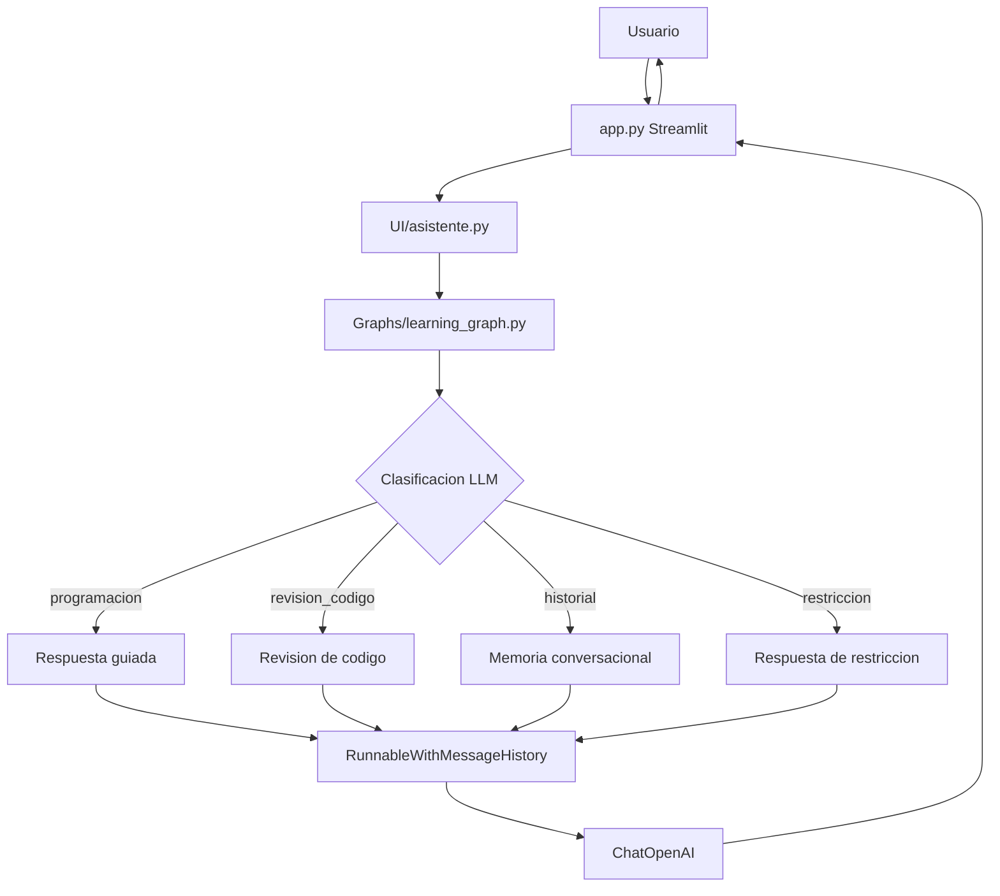

# IA-Lanchaing

Asistente educativo de programacion construido con Python, Streamlit, LangChain, LangGraph y OpenAI.

La version actual implementa un tutor guiado para aprender programacion. El sistema clasifica cada consulta con un LLM, enruta la conversacion mediante LangGraph y conserva memoria temporal por sesion para responder preguntas relacionadas con el historial.

## Tabla de contenido

- [Descripcion del proyecto](#descripcion-del-proyecto)
- [Objetivo](#objetivo)
- [Funcionalidades principales](#funcionalidades-principales)
- [Arquitectura general](#arquitectura-general)
- [Flujo con LangGraph](#flujo-con-langgraph)
- [Estructura del proyecto](#estructura-del-proyecto)
- [Documentacion del proyecto](#documentacion-del-proyecto)
- [Tecnologias utilizadas](#tecnologias-utilizadas)
- [Ejecucion del proyecto](#ejecucion-del-proyecto)
- [Estado actual](#estado-actual)
- [Mejoras recomendadas](#mejoras-recomendadas)

## Descripcion del proyecto

`IA-Lanchaing` es una aplicacion academica orientada al aprendizaje de programacion. La interfaz principal esta desarrollada en Streamlit y permite que el usuario realice preguntas, comparta dudas, pegue fragmentos de codigo o consulte informacion previamente mencionada dentro de la misma sesion.

El asistente trabaja con cuatro tipos de consulta:

| Tipo | Uso |
| --- | --- |
| `programacion` | Preguntas conceptuales o practicas sobre programacion. |
| `revision_codigo` | Analisis de codigo, errores, trazas, bugs o debugging. |
| `historial` | Preguntas que dependen de recordar informacion conversacional previa. |
| `restriccion` | Consultas fuera del dominio de programacion. |

## Objetivo

Brindar un tutor inteligente que apoye el aprendizaje de programacion con respuestas claras, guiadas y enfocadas en que el estudiante razone paso a paso.

El sistema busca:

- Guiar al estudiante sin entregar soluciones completas de inmediato.
- Separar responsabilidades entre interfaz, adaptador, grafo, prompt y configuracion.
- Clasificar consultas con un LLM para evitar reglas rigidas por palabras clave.
- Mantener memoria temporal por sesion usando `RunnableWithMessageHistory`.
- Restringir preguntas que no esten relacionadas con programacion o historial del aprendizaje.

## Funcionalidades principales

- Chat educativo con Streamlit.
- Tono fijo: `Normal, claro y amigable`.
- Modo fijo: `Aprendizaje guiado`.
- Clasificacion LLM en cuatro categorias.
- Orquestacion del flujo mediante LangGraph.
- Memoria conversacional temporal por `session_id`.
- Respuestas guiadas mediante `ChatOpenAI`.
- Prompt pedagogico con reglas por tipo de consulta.
- Boton para limpiar chat y reiniciar la memoria de la sesion.
- Tema visual uniforme basado en azul, celeste y menta.

## Arquitectura general

El proyecto sigue un monolito modular. La aplicacion se ejecuta desde `app.py`, pero la logica se divide por responsabilidades:

- `app.py`: interfaz Streamlit, estado visual del chat y constantes pedagogicas.
- `UI/`: adaptador entre Streamlit y el grafo.
- `Graphs/`: orquestacion con LangGraph, clasificacion y memoria.
- `Models/`: configuracion central del modelo.
- `Prompts/`: plantilla del comportamiento pedagogico.
- `Requirements/`: dependencias del proyecto.
- `Documentacion/`: documentacion tecnica y arquitectura.
- `HU-docs/`: historias de usuario del proyecto.



## Flujo con LangGraph

El grafo principal se encuentra en `Graphs/learning_graph.py`.

| Nodo | Responsabilidad |
| --- | --- |
| `clasificar_consulta` | Clasifica la consulta con un LLM. |
| `generar_respuesta_programacion` | Responde preguntas generales de programacion. |
| `generar_revision_codigo` | Guia la revision de codigo o errores. |
| `responder_con_historial` | Responde usando memoria conversacional disponible. |
| `responder_restriccion` | Rechaza amablemente preguntas fuera de dominio. |
| `respuesta_final` | Cierra el flujo y devuelve la respuesta a Streamlit. |


## Estructura del proyecto

```text
IA-Lanchaing/
|-- app.py
|-- README.md
|-- Documentacion/
|   |-- ARQUITECTURA_PROYECTO.md
|   `-- DOCUMENTACION_CODIGO.md
|-- Graphs/
|   |-- __init__.py
|   `-- learning_graph.py
|-- HU-docs/
|   |-- HU-001 - Asistente educativo de programacion con seleccion de tono.md
|   |-- HU_04.md
|   `-- HU_05.md
|-- Models/
|   `-- config.py
|-- Prompts/
|   `-- prompt.py
|-- Requirements/
|   `-- requirements.txt
|-- Services/
|   `-- ejemplo_Asistente_IA.py
`-- UI/
    `-- asistente.py
```

## Documentacion del proyecto

| Documento | Descripcion |
| --- | --- |
| [Documentacion del codigo](./Documentacion/DOCUMENTACION_CODIGO.md) | Explica modulos, funciones y flujo tecnico actual. |
| [Arquitectura del proyecto](./Documentacion/ARQUITECTURA_PROYECTO.md) | Describe componentes, diagramas, decisiones y riesgos. |
| [HU-05 - Clasificacion LLM y memoria conversacional](./HU-docs/HU_05.md) | Historia de usuario de la version actual. |
| [HU-04 - Aprendizaje guiado y paleta visual](./HU-docs/HU_04.md) | Historia de usuario de la fase anterior. |
| [HU-01 - Asistente educativo con seleccion de tono](./HU-docs/HU-001%20-%20Asistente%20educativo%20de%20programaci%C3%B3n%20con%20selecci%C3%B3n%20de%20tono.md) | Historia de usuario inicial. |

## Tecnologias utilizadas

| Tecnologia | Uso |
| --- | --- |
| Python | Lenguaje principal. |
| Streamlit | Interfaz web y chat. |
| LangChain | Construccion de cadenas, prompts y memoria. |
| LangGraph | Orquestacion del flujo por nodos. |
| LCEL | Composicion `Prompt | ChatOpenAI | StrOutputParser`. |
| OpenAI | Modelo conversacional. |

Modelo configurado:

| Modelo | Proposito |
| --- | --- |
| `gpt-4o-mini` | Clasificacion y generacion de respuestas. |

## Ejecucion del proyecto

Instalar dependencias:

```bash
pip install -r Requirements/requirements.txt
```

Ejecutar la aplicacion:

```bash
streamlit run app.py
```

## Estado actual

Implementado:

- Clasificacion LLM con cuatro categorias.
- Eliminacion del flujo de diagnostico, PDF, embeddings y ChromaDB.
- Memoria temporal por sesion.
- Memoria persistente local por `session_id`.
- Limite de 20 mensajes guardados por sesion.
- Restriccion amable de consultas fuera de programacion.
- Documentacion tecnica actualizada.

## Mejoras recomendadas

- Agregar pruebas unitarias para la normalizacion de categorias.
- Agregar pruebas del enrutamiento de LangGraph.
- Persistir memoria en una base de datos cuando se estudie manejo de sesiones.
- Agregar streaming de tokens en Streamlit.
- Separar el CSS de `app.py` si la interfaz sigue creciendo.
