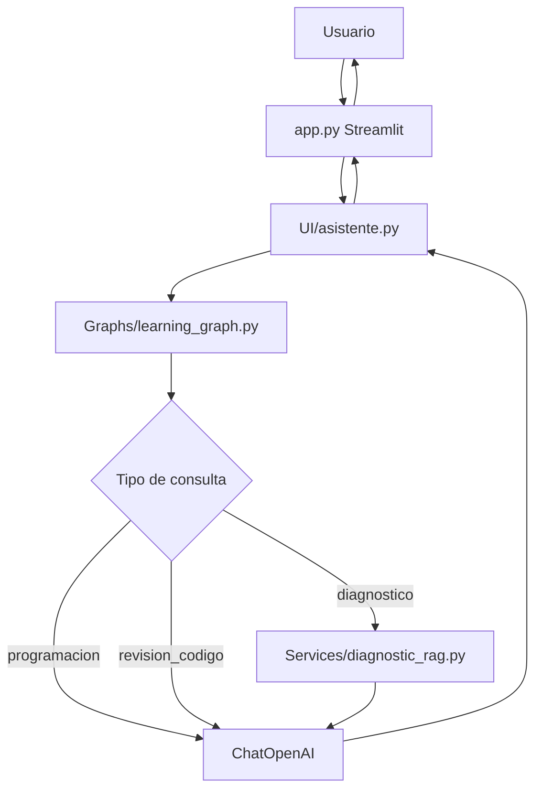
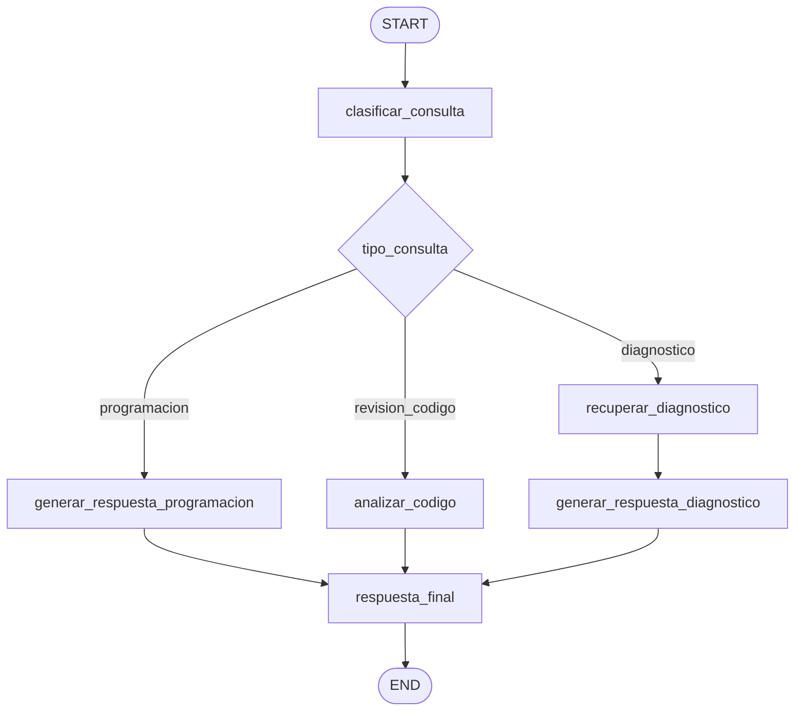

# IA-Lanchaing

Asistente educativo de programacion construido con Python, Streamlit, LangChain, LangGraph, OpenAI y ChromaDB. El proyecto permite que un estudiante interactue con un tutor inteligente capaz de responder preguntas de programacion, adaptar sus explicaciones segun el tono y modo de aprendizaje seleccionados, y consultar informacion de un diagnostico educativo mediante RAG.

La version actual incorpora una capa de orquestacion con LangGraph. Esto permite separar el flujo en nodos especializados para clasificar la consulta, recuperar contexto diagnostico cuando aplica, generar respuestas de programacion, atender revisiones de codigo y preparar una respuesta final para la interfaz.

## Tabla de contenido

- [Descripcion del proyecto](#descripcion-del-proyecto)
- [Objetivo](#objetivo)
- [Funcionalidades principales](#funcionalidades-principales)
- [Arquitectura general](#arquitectura-general)
- [Flujo con LangGraph](#flujo-con-langgraph)
- [Estructura del proyecto](#estructura-del-proyecto)
- [Documentacion del proyecto](#documentacion-del-proyecto)
- [Tecnologias utilizadas](#tecnologias-utilizadas)
- [Ejecucion del proyecto](#ejecucion-del-proyecto)
- [Estado actual](#estado-actual)
- [Mejoras recomendadas](#mejoras-recomendadas)

## Descripcion del proyecto

`IA-Lanchaing` es una aplicacion academica orientada al aprendizaje de programacion. Su interfaz principal esta desarrollada en Streamlit y ofrece una experiencia de chat donde el usuario puede realizar preguntas, solicitar explicaciones, pedir revision de codigo o consultar informacion relacionada con un diagnostico educativo.

El asistente combina tres capacidades:

- **Asistencia general de programacion:** responde preguntas sobre conceptos, errores, estructuras de control, listas, variables, ciclos y ejercicios.
- **Consulta contextual con RAG:** recupera informacion desde un PDF diagnostico previamente procesado e indexado en ChromaDB.
- **Orquestacion con LangGraph:** dirige cada consulta por un flujo de nodos segun el tipo de pregunta.

## Objetivo

El objetivo del proyecto es brindar un tutor inteligente que apoye el proceso de aprendizaje de programacion de forma personalizada, clara y contextualizada.

El sistema busca:

- Ayudar al estudiante a comprender conceptos de programacion.
- Adaptar el estilo de respuesta al tono elegido.
- Ajustar la explicacion al modo de aprendizaje seleccionado.
- Usar un diagnostico educativo como fuente de contexto cuando la pregunta lo requiera.
- Separar responsabilidades internas mediante un grafo de LangGraph.
- Mantener una base modular para evolucionar hacia una arquitectura mas robusta.

## Funcionalidades principales

- Chat educativo mediante Streamlit.
- Selector de tono del asistente.
- Selector de modo de aprendizaje.
- Procesamiento de un PDF diagnostico.
- Creacion de una base vectorial local con ChromaDB.
- Recuperacion de contexto mediante embeddings de OpenAI.
- Generacion de respuestas con `ChatOpenAI`.
- Prompt pedagogico configurable.
- Orquestacion del flujo mediante LangGraph.
- Clasificacion de consultas: diagnostico, programacion y revision de codigo.
- Historial de conversacion en `st.session_state`.
- Boton para reconstruir el diagnostico desde la interfaz.

## Arquitectura general

El proyecto sigue un estilo de monolito modular. La aplicacion se ejecuta desde `app.py`, pero distribuye responsabilidades en carpetas especializadas:

- `UI/`: capa de entrada del asistente para Streamlit.
- `Graphs/`: flujos de LangGraph y estado del asistente.
- `Services/`: servicios de procesamiento documental y recuperacion RAG.
- `Models/`: configuracion central del proyecto.
- `Prompts/`: plantilla principal enviada al modelo.
- `docs/`: documento PDF usado como fuente de conocimiento.
- `chroma_diagnostico/`: base vectorial persistente.
- `Documentacion/`: documentacion tecnica y arquitectura.
- `HU-docs/`: documentacion de historias de usuario.

Flujo principal:



## Flujo con LangGraph

El grafo principal se encuentra en `Graphs/learning_graph.py` y define los siguientes nodos:

| Nodo | Responsabilidad |
| --- | --- |
| `clasificar_consulta` | Identifica si la pregunta es de diagnostico, programacion o revision de codigo. |
| `recuperar_diagnostico` | Consulta ChromaDB y obtiene contexto del PDF cuando aplica. |
| `generar_respuesta_programacion` | Genera respuestas generales de programacion sin usar contexto diagnostico. |
| `generar_respuesta_diagnostico` | Genera respuestas usando el contexto recuperado del diagnostico. |
| `analizar_codigo` | Procesa consultas de revision de codigo usando el modo pedagogico correspondiente. |
| `respuesta_final` | Prepara la respuesta final que se devuelve a Streamlit. |



## Estructura del proyecto

```text
IA-Lanchaing/
|-- app.py
|-- README.md
|-- chroma_diagnostico/
|-- docs/
|   `-- Reporte_Ejecutivo_Encuesta_Programacion.pdf
|-- Documentacion/
|   |-- ARQUITECTURA_PROYECTO.md
|   `-- DOCUMENTACION_CODIGO.md
|-- Graphs/
|   |-- __init__.py
|   `-- learning_graph.py
|-- HU-docs/
|   |-- HU_Asistente_Educativo_RAG.md
|   `-- HU_Integracion_LangGraph_Asistente_Educativo.md
|-- Models/
|   `-- config.py
|-- Prompts/
|   `-- prompt.py
|-- Services/
|   |-- diagnostic_rag.py
|   |-- ejemplo_Asistente_IA.py
|   `-- setup_diagnostic_rag.py
`-- UI/
    `-- asistente.py
```

## Documentacion del proyecto

| Documento | Descripcion |
| --- | --- |
| [Documentacion del codigo](./Documentacion/DOCUMENTACION_CODIGO.md) | Explica los modulos, funciones, clases, flujo de datos, comandos utiles y hallazgos tecnicos. |
| [Arquitectura del proyecto](./Documentacion/ARQUITECTURA_PROYECTO.md) | Describe el estilo arquitectonico, componentes, diagramas, integraciones, riesgos y recomendaciones. |
| [HU-01 - Asistente educativo con RAG](./HU-docs/HU_Asistente_Educativo_RAG.md) | Resume la primera fase del asistente educativo y su RAG diagnostico. |
| [HU-02 - Integracion de LangGraph](./HU-docs/HU_Integracion_LangGraph_Asistente_Educativo.md) | Describe la incorporacion del grafo de LangGraph para orquestar el flujo. |

## Tecnologias utilizadas

| Tecnologia | Uso |
| --- | --- |
| Python | Lenguaje principal. |
| Streamlit | Interfaz web y chat. |
| LangChain | Construccion de cadenas, prompts y procesamiento documental. |
| LangGraph | Orquestacion del flujo por nodos y estado compartido. |
| LCEL | Composicion del pipeline `PromptTemplate | ChatOpenAI | StrOutputParser`. |
| OpenAI | Modelo conversacional y embeddings. |
| ChromaDB | Base vectorial local. |
| PyPDFLoader | Carga del PDF diagnostico. |
| RecursiveCharacterTextSplitter | Division del documento en fragmentos. |

Modelos configurados:

| Modelo | Proposito |
| --- | --- |
| `gpt-4o-mini` | Generacion de respuestas. |
| `text-embedding-3-small` | Creacion de embeddings para busqueda semantica. |

## Ejecucion del proyecto

Desde la raiz del proyecto, reconstruir el diagnostico:

```bash
python -m Services.setup_diagnostic_rag
```

Ejecutar la aplicacion:

```bash
streamlit run app.py
```

Probar el sistema RAG por consola:

```bash
python -m Services.diagnostic_rag
```

## Estado actual

El proyecto se encuentra en estado de prototipo funcional avanzado. Ya cuenta con interfaz de usuario, integracion con un LLM, procesamiento de PDF, base vectorial local, recuperacion de contexto mediante RAG y un flujo inicial de LangGraph para orquestar consultas.

## Mejoras recomendadas

- Limpiar textos con problemas de codificacion.
- Reemplazar imports wildcard en `app.py` por imports explicitos.
- Crear un archivo de dependencias como `requirements.txt` o `pyproject.toml`.
- Agregar pruebas automatizadas con `pytest`.
- Validar que ChromaDB no solo exista, sino que contenga documentos.
- Agregar manejo especifico de errores de OpenAI.
- Incorporar medicion de latencia, tokens y costos.
- Evaluar memoria conversacional persistente en una HU futura.
